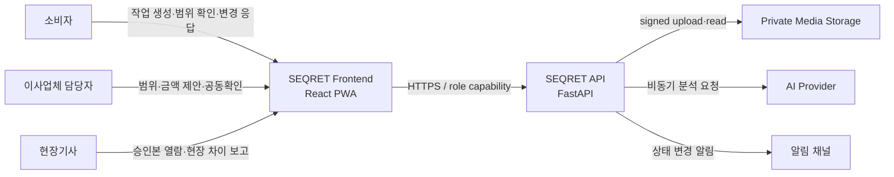
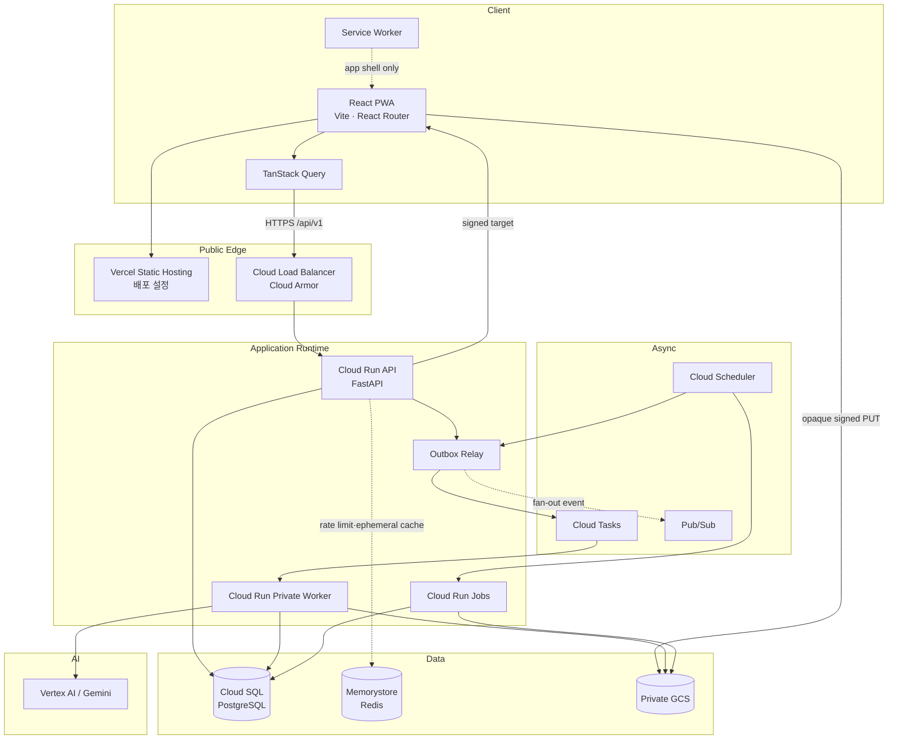
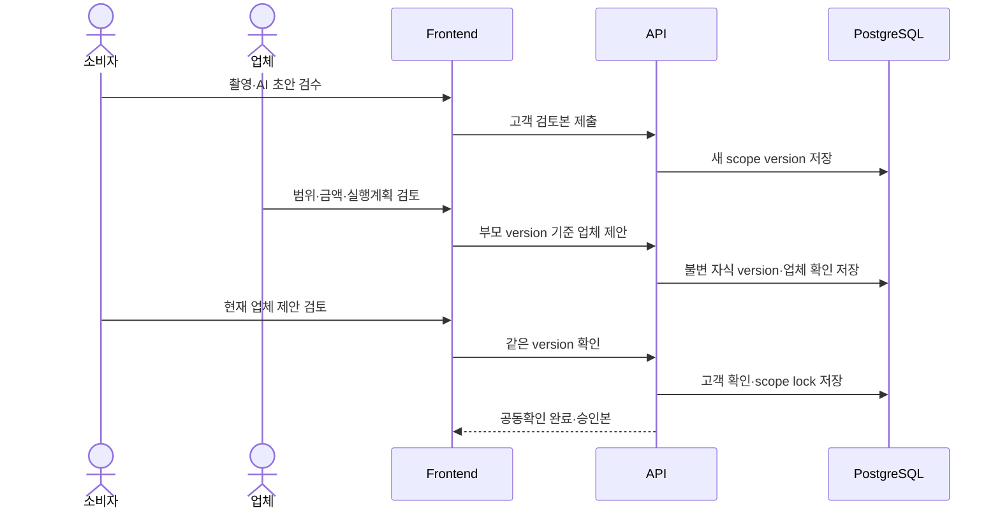
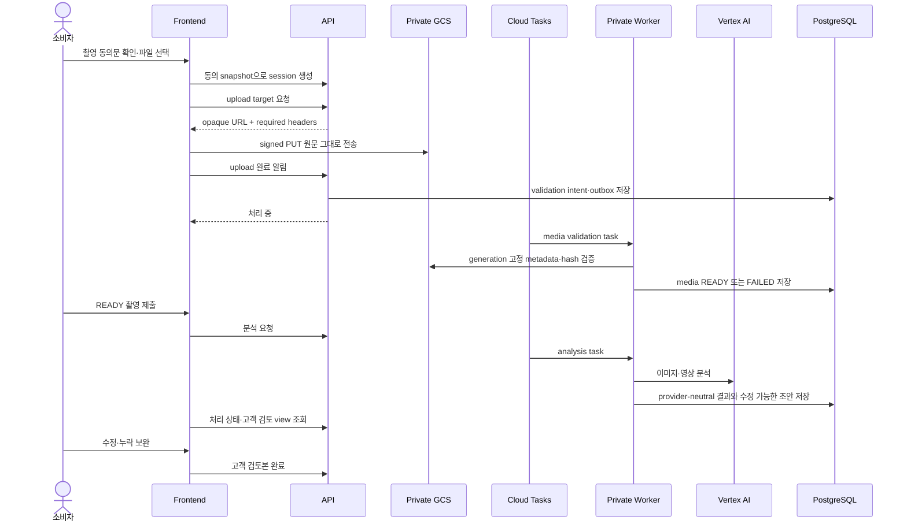
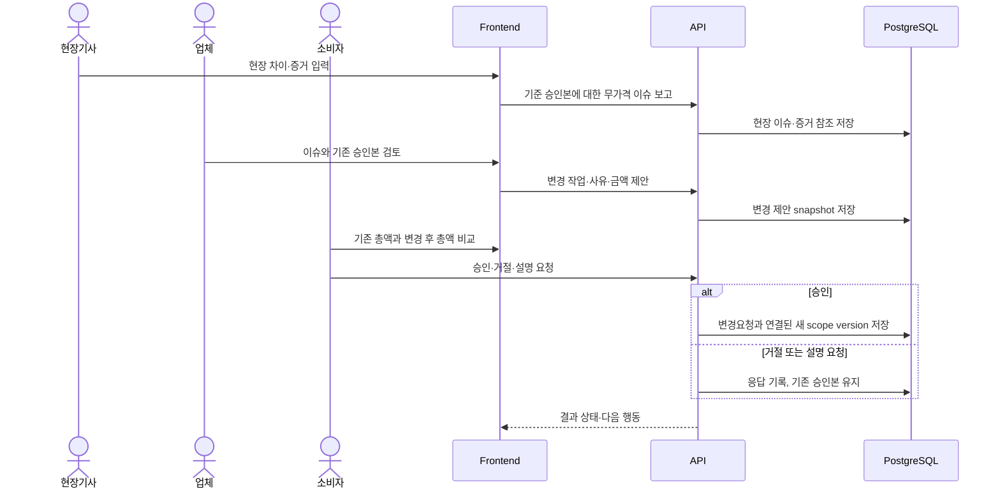

# SEQRET 시스템 아키텍처

## 아키텍처 목표

SEQRET은 소비자, 이사업체 담당자와 현장기사가 같은 작업범위 버전과 변경 이력을 확인하는 서비스다. 시스템은 다음 속성을 우선한다.

- 공동확인된 작업범위와 금액을 같은 버전 안에서 수정하지 않는다.
- 현장 변경은 기존 승인본을 덮어쓰지 않고 별도 요청과 결과 버전으로 남긴다.
- 사진·영상은 비공개로 저장하고 제한 시간 접근만 허용한다.
- 업로드·AI 분석·삭제·알림은 사용자 요청과 분리된 비동기 작업으로 처리한다.
- 외부 provider 장애가 핵심 거래 기록을 손상시키지 않도록 Port·adapter와 Outbox 경계를 둔다.
- 역할 링크와 signed URL을 개인 신원 인증이나 영구 접근 수단으로 취급하지 않는다.

## 시스템 컨텍스트

세 역할은 같은 frontend를 사용하지만 서로 다른 capability와 허용 행동을 가진다. URL을 안다고 권한이 생기는 것이 아니라, backend가 매 요청에서 작업과 역할을 함께 검증한다.

## Container 구조

## 책임과 단일 원본

| 데이터                | 단일 원본                   | 원칙                                                         |
| --------------------- | --------------------------- | ------------------------------------------------------------ |
| 작업·참여자·역할    | PostgreSQL                  | browser local state는 표시용이며 권한 원본이 아니다.         |
| 작업범위 버전·금액   | PostgreSQL                  | 승인본은 append-only 방식으로 보존한다.                      |
| 확인·변경·감사 이력 | PostgreSQL                  | 일반 application 흐름에서 과거 기록을 수정·삭제하지 않는다. |
| 비공개 사진·영상     | GCS                         | DB에는 검증된 object key, generation과 metadata만 저장한다.  |
| 비동기 전달 상태      | Outbox와 작업 table         | provider queue 자체를 업무 상태 원본으로 사용하지 않는다.    |
| cache·rate limit     | Redis                       | DB 원본을 대체하지 않는 보조 저장소다.                       |
| UI server state       | TanStack Query memory cache | 영구 원본이 아니며 서버 응답으로 재검증한다.                 |
| API schema            | 검증된 backend OpenAPI      | frontend 문서나 수기 type이 실행 계약을 덮어쓰지 않는다.     |

## 핵심 도메인 흐름

### 작업범위 제안과 공동확인

핵심 불변식:

- 확인은 특정 version ID에 귀속된다.
- 서로 다른 version의 확인 두 개를 합쳐 공동확인 완료로 만들지 않는다.
- 확인 후 수정은 기존 version 변경이 아니라 새 version 생성이다.
- 동시에 오래된 version을 기준으로 제출하면 자동 덮어쓰지 않고 충돌을 반환한다.

### 미디어 업로드와 AI 초안

핵심 불변식:

- signed URL과 header는 frontend가 해석·재정렬·정규화하지 않는다.
- 저장된 object generation을 검증·열람·삭제까지 유지한다.
- AI 결과는 승인본을 직접 만들거나 사용자 수정값을 덮어쓰지 않는다.
- AI 또는 업로드 실패가 이미 성공한 텍스트와 파일을 제거하지 않는다.

### 현장 변경

## Application 경계

- route 진입과 화면 조합은 page 계층이 담당한다.
- 제품 기능과 역할별 흐름은 feature 계층이 담당한다.
- 공통 UI component는 제품 업무 상태를 직접 소유하지 않는다.
- server state는 query·mutation으로 관리하고 component local state는 일시적인 UI 상태에만 사용한다.
- route query parameter와 demo screen 번호를 업무 상태 원본으로 사용하지 않는다.
- frontend는 provider SDK를 직접 사용하지 않는다. 예외는 backend가 발급한 opaque signed target으로 media를 전송하는 경우뿐이다.
- frontend는 `/`, `/consumer`, `/consumer/capture`, `/provider/web`, `/crew`, `/design-system`을 lazy route로 구성하며 `/provider`는 web 화면으로 이동한다.
- capability secret은 browser memory에만 두고 Query cache도 persistence하지 않는다.

## Backend 경계

Backend는 domain·application과 provider adapter를 분리한다.

| 경계             | 책임                                                                           |
| ---------------- | ------------------------------------------------------------------------------ |
| HTTP/API         | 요청 검증, capability 인증, application command·query 호출, 응답 mapping      |
| Application      | transaction 단위 use case와 권한·불변식 조정                                  |
| Domain           | 작업범위 version, 확인, 변경요청과 감사 규칙                                   |
| Port             | Storage, Task Queue, AI Provider, Event Bus, Cache의 provider-independent 계약 |
| Adapter          | GCS, Cloud Tasks, Vertex AI, Pub/Sub, Redis 구현                               |
| Outbox·Consumer | DB commit 뒤 at-least-once 전달과 consumer 중복 효과 방지                      |

Adapter는 다른 track의 ORM을 직접 갱신하지 않는다. 비동기 결과도 application command를 통해 domain 상태에 반영한다.

## 인증과 보안 경계

- 업무 API prefix는 `/api/v1`이다.
- 인증은 `Authorization: Bearer <access-link-secret>`을 사용한다.
- 역할값은 `customer`, `company_manager`, `field_worker`다.
- capability는 한 작업과 역할에 묶이며 개인 신원을 증명하지 않는다.
- 다른 작업의 resource는 존재 여부 노출을 줄이기 위해 `404`, 역할 부족은 `403`을 사용한다.
- secret과 signed URL 응답은 `Cache-Control: no-store`이며 PWA cache·영구 저장소·로그·analytics에서 제외한다.
- production은 `/docs`, `/redoc`, `/openapi.json`을 공개하지 않는다. schema는 검증된 비운영 환경에서 생성한다.
- API CORS와 GCS bucket CORS는 별도로 관리하고 실제 canonical frontend HTTPS origin만 허용한다.
- 공개 bootstrap route의 신뢰 주체와 capability 전달 채널이 정해지기 전에는 일반 사용자 flow에 노출하지 않는다.

## 비동기 처리와 복구

- API transaction에서 업무 상태와 Outbox event를 함께 commit한다.
- relay와 queue 전달은 at-least-once이므로 event ID와 idempotency key로 중복 효과를 막는다.
- retry 가능한 provider 오류와 영구 실패를 구분한다.
- worker lease와 처리 상태는 관측 가능해야 하며 실패 작업은 승인된 방식으로 재실행한다.
- schema downgrade가 감사·완료·분석 이력을 제거할 수 있으면 차단하고 application revision만 전환한다.
- 장시간 삭제·복구·정합성 작업은 API request가 아니라 별도 job으로 실행한다.

## PWA와 cache 원칙

- service worker는 app shell과 공개 정적 asset만 다룬다.
- 역할 secret, signed URL, 작업·승인·감사 응답은 cache하지 않는다.
- offline 상태에서 과거 승인본을 최신 상태처럼 표시하지 않는다.
- 네트워크가 없으면 읽기·쓰기 가능 여부와 마지막 확인 시점을 명확히 표시한다.
- 새 배포는 `autoUpdate` 정책을 사용하되 작성 중 데이터가 사라지지 않도록 update UX를 검증한다.

## 아키텍처 변경 규칙

- 제품 범위를 바꾸는 구조 변경은 먼저 PRD 결정 로그를 갱신한다.
- API 변경은 backend code·test·OpenAPI 반영 뒤 frontend에 적용한다.
- 새로운 provider는 기존 Port를 만족하는 adapter로 추가하고 domain type에 provider 값을 노출하지 않는다.
- 승인본·감사·미디어 접근 경계를 바꾸는 변경은 migration, rollback과 보안 검토를 함께 기록한다.
- diagram은 구현과 불일치하게 되면 같은 변경에서 갱신한다.
