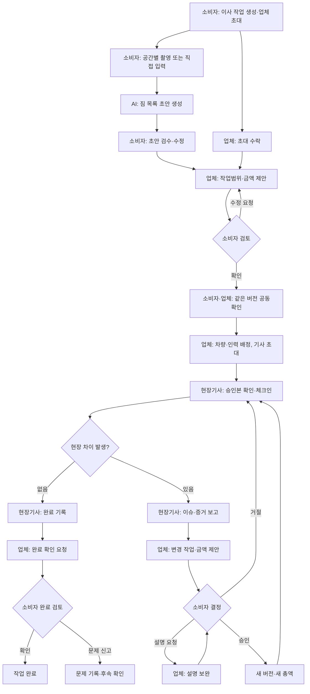

# SEQRET 프론트 제품 흐름 및 설계 브리프

## 문서 역할

이 문서는 페이지 목록이나 와이어프레임을 확정하지 않는다. 프론트 디자인을 시작할 때 필요한 사용자 흐름, 역할별 목적, 필수 정보와 상태를 정의한다.

하나의 흐름을 전체 화면, 탭, 상세 화면, 바텀시트 중 무엇으로 표현할지는 이후에 결정한다. 먼저 이 문서의 흐름과 역할 경계를 보존한 뒤 화면 수와 구조를 정한다.

### 기준 자료

- 제품 목적과 규칙: [PRD](prd.md), [리서치](research.md), [아키텍처](architecture.md)
- 프론트 연동 원칙: [API 연동 규격](api-spec.md), [기술 스택](tech-stack.md)
- 백엔드 기능: [`SEQRET_BE` `main`](https://github.com/SEQRETE-TUK/SEQRET_BE/tree/397d6f1b8af51a09617684d37b54024004381b12)
- 확인한 백엔드 커밋: `397d6f1b8af51a09617684d37b54024004381b12` (2026-08-16)

실제 요청값과 응답값은 연동 시점의 백엔드 OpenAPI를 따른다. 이 문서는 API 명세를 복제하지 않고 디자인에 필요한 의미만 다룬다.

---

## 1. 제품 이해

### 한 줄 정의

> 소비자·이사업체·현장기사가 같은 작업범위와 금액을 확인하고, 현장에서 달라진 내용도 기존 합의를 덮어쓰지 않은 채 다시 결정하는 공동 기록 도구

SEQRET은 이사업체를 찾거나 여러 견적을 비교하는 서비스가 아니다. 소비자가 업체를 선택한 이후부터 이사가 끝날 때까지 서로 다른 역할이 같은 기준으로 일하도록 돕는다.

### 제품의 핵심 원칙

1. **세 역할이 같은 기준을 본다.** 현재 승인된 작업범위와 금액의 의미가 역할마다 달라지면 안 된다.
2. **확인된 내용은 덮어쓰지 않는다.** 수정하면 새 버전이 생기며 이전 내용과 확인 기록은 남는다.
3. **현장 변경은 별도로 결정한다.** 사유·증거·변경 작업·증감액을 확인한 뒤 소비자가 승인·거절·설명 요청을 한다.
4. **AI는 초안만 만든다.** 짐 목록 작성을 돕지만 가격·차량·인원·파손 책임을 결정하지 않는다.
5. **실패해도 흐름이 끊기지 않는다.** AI나 업로드가 실패하면 작성한 내용을 보존하고 직접 입력으로 계속할 수 있어야 한다.

### 디자인이 계속 답해야 하는 질문

- 지금 이사는 어느 단계인가?
- 현재 확정된 작업범위와 금액은 무엇인가?
- 누가 마지막으로 무엇을 했는가?
- 지금 행동해야 하는 사람은 누구이며, 내가 할 일은 무엇인가?
- 수정·거절·설명 요청을 하면 기존 합의는 어떻게 되는가?
- 지금 보는 내용은 AI 초안, 업체 제안, 공동확인된 승인본 중 무엇인가?

---

## 2. 사용자와 역할 경계

| 역할 | 주로 접속하는 상황 | 가장 먼저 알고 싶은 것 | 주요 행동 | 할 수 없는 것 |
| --- | --- | --- | --- | --- |
| 소비자 | 이사 정보를 작성하거나 업체·현장의 요청에 응답할 때 | 현재 범위·금액과 내가 확인할 내용 | 작업 생성, 짐 검수, 업체 초대, 범위 확인·수정 요청, 변경 결정, 완료 확인 | 업체 배차 확정, 현장기사 대신 보고 |
| 업체 담당자 | 고객 정보를 검토하고 실제 작업을 계획할 때 | 처리할 작업과 진행을 막는 문제 | 범위·금액 제안, 기사 초대, 배차, 현장 이슈 견적, 완료 확인 요청 | 소비자 대신 승인, 현장 사실 대신 확정 |
| 현장기사 | 이사 전 또는 당일 현장에서 | 오늘 작업의 승인 범위·조건·다음 행동 | 승인본 확인, 체크인, 현장 이슈 보고, 완료 기록 | 가격 확정, 소비자 승인 대행, 승인본 수정 |

역할마다 정보의 우선순위는 달라도 다음 값은 같은 의미로 보여야 한다.

- 작업명·일정·출발지·도착지
- 현재 작업범위 버전과 상태
- 기준 금액, 승인된 변경과 현재 총액
- 각 역할의 확인 여부
- 현재 행동할 역할과 다음 행동
- 주요 변경과 확인 시각

---

## 3. 전체 사용자 흐름

### 흐름을 설계할 때 지켜야 할 분기

- 업체가 참여하지 않아도 소비자는 단독 초안을 작성할 수 있다. 이때는 `업체 미참여·공동확인 전` 상태를 분명히 보여준다.
- AI 분석은 선택 흐름이다. 실패하면 성공한 입력을 유지한 채 직접 입력으로 이어진다.
- 소비자의 수정 요청은 기존 제안을 직접 고치는 행동이 아니다. 업체가 새 제안을 만들도록 돌려보낸다.
- 현장 이슈는 매번 거치는 단계가 아니다. 필요할 때 발생하는 분기로 표현한다.
- 설명 요청이나 거절은 기존 승인본과 총액을 바꾸지 않는다.
- 승인된 현장 변경만 새 버전과 새 총액에 반영된다.

### 역할 간 전달

| 보내는 역할 | 받는 역할 | 전달하는 것 | 받은 역할의 다음 행동 |
| --- | --- | --- | --- |
| 소비자 | 업체 | 이사 조건과 검수한 짐 목록 | 작업범위·금액 검토 |
| 업체 | 소비자 | 범위·포함·제외·금액 제안 | 확인 또는 수정 요청 |
| 업체 | 현장기사 | 공동확인된 범위와 배차 정보 | 작업 전 확인·체크인 |
| 현장기사 | 업체 | 현장 차이와 증거 | 변경 작업·금액 제안 |
| 업체 | 소비자 | 현장 변경안 | 승인·거절·설명 요청 |
| 현장기사 | 업체 | 완료 체크리스트와 작업 기록 | 완료 확인 요청 |
| 업체 | 소비자 | 최종 범위·금액·완료 기록 | 완료 확인 또는 문제 신고 |

요청을 보낸 뒤에는 `전송 완료`만 보여주지 않는다. 다음 담당자가 누구인지와 현재 무엇을 기다리는지 함께 알려야 한다.

---

## 4. 단계별 디자인 요구사항

### 4.1 작업 생성과 역할 연결

**목적**

- 소비자는 이사 작업의 기본 맥락을 만들고 선택한 업체를 초대한다.
- 업체와 현장기사는 자신이 어떤 작업에 어떤 역할로 초대됐는지 이해한다.

**보여야 하는 정보**

- 작업명, 이사 예정일, 출발지·도착지 표시명
- 촬영과 짐 분류에 사용할 공간 구성
- 현재 접속 역할과 초대한 사람
- 초대 상태와 만료 시각
- 업체 또는 현장기사의 참여 여부

**필요한 행동**

- 소비자의 작업 생성
- 업체 초대, 업체의 수락·거절
- 업체의 현장기사 초대
- 초대 폐기·재발급
- 업체 참여 전 소비자의 단독 작성

**주요 상태**

- 초대 대기, 수락, 거절, 만료, 폐기
- 잘못된 링크, 권한 부족, 이미 처리된 초대
- 업체 미참여·공동확인 전

역할 링크는 로그인 계정이나 신원 인증이 아니다. 만료 원인을 기술적으로 설명하기보다 안전한 재초대 행동을 제공한다.

### 4.2 촬영·업로드와 AI 초안 검수

**목적**

- 소비자가 업체 검토에 필요한 짐과 작업 정보를 빠짐없이 정리한다.

**보여야 하는 정보**

- 공간 목록과 공간별 촬영 진행 정도
- 파일별 업로드·처리 상태
- AI 분석 진행 상태
- AI가 제안한 항목, 직접 추가한 항목, 확인이 필요한 항목
- 각 항목의 공간·설명·근거 미디어

**필요한 행동**

- 사진·영상 추가와 삭제
- 실패한 파일만 다시 시도
- 분석 제출
- AI 항목 수정·삭제, 직접 항목 추가
- 분석 실패 후 직접 입력으로 전환
- 검수 완료 후 업체에 전달

**주요 상태**

- 파일: 업로드 대기, 처리 중, 준비 완료, 실패
- 분석: 대기, 분석 중, 완료, 실패
- 검수: AI 제안, 고객 수정, 확인 필요, 검수 완료

AI 결과는 `자동으로 확정된 목록`이 아니라 `사람이 확인할 초안`으로 표현한다. AI 신뢰도 수치를 보여주더라도 수치 해석만으로 사용자의 다음 행동을 결정하게 만들지 않는다.

### 4.3 작업범위·금액 제안과 공동확인

**목적**

- 업체가 수행할 작업과 가격을 제안한다.
- 소비자가 제안 내용을 확인하거나 수정을 요청한다.
- 양측이 같은 버전을 확인하면 현장 실행 기준으로 잠근다.

**비교 가능해야 하는 정보**

- 현재 버전, 작성자와 제안 시각
- 공간별 짐과 작업 항목
- 포함 작업과 제외 작업
- 기본 금액, 조정 항목과 총액
- 업체의 제안 이유
- 소비자·업체 각각의 확인 여부와 시각
- 이전 버전과 달라진 내용

**필요한 행동**

- 업체의 항목·포함·제외·금액 편집과 새 제안 전송
- 소비자의 제안·증빙 확인
- 소비자의 수정 요청 사유 작성 또는 현재 버전 확인

**주요 상태**

- 업체 검토 중
- 소비자 확인 대기
- 수정 요청됨
- 공동확인 완료
- 다른 곳에서 새 버전이 생긴 충돌

`확인`을 결제·전자서명·법적 책임 인정처럼 표현하지 않는다. 새 버전이 생기면 이전 확인은 남지만 새 버전에 적용되지 않는다는 점을 보여준다.

### 4.4 배차와 현장 준비

**목적**

- 업체가 승인 범위에 맞는 차량과 인력을 배정한다.
- 현장기사가 작업 전에 승인 범위와 현장 조건을 확인한다.

**업체에 필요한 정보와 행동**

- 시작 시각, 예상 작업시간
- 필요한 차량 용량, 작업자 수, 기술·자격 조건
- 차량·작업자 후보와 사용할 수 없는 이유
- 차량, 대표 기사와 작업자 선택·확정
- 기사 초대와 참여 여부

**현장기사에게 필요한 정보와 행동**

- 일정과 마스킹된 출발·도착 정보
- 최신 승인 범위 버전
- 차량, 함께 작업할 인원과 현장 조건
- 안전 안내와 체크인 전 확인사항
- 체크리스트 확인과 도착 체크인

**주요 상태**

- 배차 준비 필요, 배정 가능, 확정
- 차량·작업자 충돌 또는 자격 미달
- 범위 변경으로 기존 배차가 오래된 상태

업체 화면은 후보 비교와 충돌 해결에 집중한다. 현장기사 화면은 관리 대시보드보다 오늘의 작업과 다음 행동을 우선한다.

### 4.5 현장 이슈와 변경 재승인

**목적**

- 현장기사가 승인본과 다른 사실을 보고한다.
- 업체가 그 사실을 작업·금액 변경안으로 만든다.
- 소비자가 기존 합의와 변경 후 결과를 비교해 결정한다.

**현장기사에게 필요한 정보와 행동**

- 기준 승인 버전
- 이슈 유형: 범위 밖 작업, 파손 위험, 현장 장애
- 제목·설명·필수 증거
- 증거 업로드 상태와 재시도
- 보고 후 업체 처리 상태

현장기사는 현장 사실을 보고하지만 금액은 확정하지 않는다.

**업체에 필요한 정보와 행동**

- 현장기사의 설명과 증거
- 기준 범위와 기존 금액
- 추가·제외·변경되는 작업
- 증감 사유, 증감액과 변경 후 총액
- 고객에게 변경안 전송
- 설명 요청에 대한 답변

**소비자에게 필요한 정보와 행동**

- 무엇이 왜 달라졌는지와 현장 증거
- 기존 금액, 증감액, 변경 후 총액
- 승인, 거절, 설명 요청
- 거절·설명 요청의 필수 사유

**주요 상태**

- 현장 이슈 접수
- 업체 변경안 작성 중
- 소비자 확인 대기
- 설명 요청됨
- 승인 또는 거절
- 다른 담당자가 먼저 처리함
- 기준 버전이 바뀐 충돌

`현장 보고 → 업체 견적 → 소비자 결정`의 책임을 섞지 않는다. 승인 행동 주변에는 기준 버전과 변경 전후 금액을 함께 보여준다.

### 4.6 완료 기록과 소비자 확인

**목적**

- 현장기사가 작업 결과를 기록한다.
- 업체가 기록을 검토해 소비자에게 완료 확인을 요청한다.
- 소비자가 완료 내용과 최종 금액을 확인하거나 문제를 신고한다.

**현장기사에게 필요한 정보와 행동**

- 체크인 시각과 승인 범위 버전
- 완료 체크리스트
- 선택적인 공간별 완료 사진
- 작업자별 시작·종료 시각과 근무시간
- 현장 고객 확인 여부
- 현장 변경 요약과 완료 기록 제출

**업체에 필요한 정보와 행동**

- 완료 제출 여부, 실제 작업시간과 체크리스트
- 완료 사진, 현장 확인과 승인된 변경
- 최종 금액
- 소비자 완료 확인 요청과 요청 철회
- 견적·변경·완료·결정 문서 준비 상태

**소비자에게 필요한 정보와 행동**

- 완료 시각과 승인 범위 버전
- 기본 합의금, 승인된 변경과 최종 금액
- 완료 사진·체크리스트·작업시간
- 완료 확인 또는 문제 신고
- 문제 유형: 작업 누락, 파손, 금액, 기타

**주요 상태**

- 완료 기록 전, 완료 제출됨
- 고객 확인 요청 전, 확인 요청됨
- 완료 확인, 문제 신고
- 요청 철회, 만료
- 문서 준비 중, 완료, 실패

완료 사진은 선택 사항이다. 문제 신고는 책임 판정이 아니라 문제 사실을 기록하는 행동이다. PRD에서는 완료 흐름이 P1이지만 백엔드는 구현돼 있으므로, 핵심 공동확인 흐름을 가리지 않는 종료 단계로 다룬다.

---

## 5. 역할별 시작점과 공통 화면 위계

시작 화면의 형태나 탭 개수는 아직 확정하지 않는다. 각 역할의 첫 진입점은 다음 내용을 우선 전달한다.

| 역할 | 첫 화면이 답해야 하는 질문 | 우선 정보 |
| --- | --- | --- |
| 소비자 | 지금 내가 작성하거나 확인할 것은 무엇인가? | 현재 작업, 다음 행동, 최신 범위·금액, 업체 연결 상태 |
| 업체 담당자 | 지금 처리할 작업과 막힌 문제는 무엇인가? | 처리 대기 작업, 범위·견적, 배차·현장 이슈, 완료 상태 |
| 현장기사 | 오늘 어디에서 무엇을 해야 하는가? | 오늘 작업, 승인 범위, 현장 조건, 체크인·이슈·완료 행동 |

### 화면에서 유지할 작업 맥락

모든 값을 매 화면마다 반복할 필요는 없지만 사용자가 다음 맥락을 쉽게 확인할 수 있어야 한다.

- 작업명 또는 작업 코드
- 이사 일정과 현재 단계
- 출발지·도착지 요약
- 현재 접속 역할
- 현재 작업범위 버전과 확인 상태
- 기준 금액과 현재 총액
- 현재 행동할 역할과 대표 행동
- 마지막 상태 변경 시각

### 기본 정보 위계

1. 작업 맥락
2. 현재 상태와 다음 행동
3. 판단에 필요한 핵심 내용
4. 대표 행동
5. 기록과 보조 정보

모든 정보를 카드로 나열하지 않는다. 관련 정보는 한 덩어리로 묶고, 사용자의 판단과 행동 순서에 따라 배치한다.

---

## 6. 반복해서 필요한 UI 패턴

| 패턴 | 사용 목적 | 포함할 내용 |
| --- | --- | --- |
| 상태 요약 | 현재 위치와 다음 행동 안내 | 현재 단계, 기다리는 역할, 마지막 변경 시각 |
| 작업 헤더 | 작업 맥락 유지 | 작업 코드, 일정, 출·도착 요약, 접속 역할 |
| 공간별 목록 | 촬영·AI 검수·범위 확인 | 공간, 항목 수, 확인 필요 수 |
| 미디어 업로더 | 짐·현장 증거·완료 사진 | 파일 상태, 실패 항목 재시도, 삭제 |
| AI 검수 목록 | 소비자 짐 검수 | AI·사용자 출처, 확인 필요, 수정·삭제·추가 |
| 버전 비교 | 범위 제안·현장 변경 | 버전, 작성자, 변경 요약, 확인 상태 |
| 금액 비교 | 범위·변경·완료 | 기본 금액, 조정 항목, 변경 전후, 최종 금액 |
| 체크리스트 | 체크인·완료 제출 | 필수 여부, 완료 정도, 미완료 이유 |
| 증거 보기 | 범위·현장 변경·완료 | 실제 이미지, 공간·사유 연결, 로드 실패 |
| 사유 입력 | 수정·설명 요청·거절·문제 신고 | 선택한 행동, 필수 사유, 글자 수 |
| 충돌 복구 | 범위·배차·변경 | 바뀐 내용, 보존된 입력, 최신 정보 보기 |
| 상태 이력 | 변경·완료 상세 | 요청, 설명, 결정의 순서와 행위자 |

핵심 내용과 비교가 길면 전체 화면이나 상세 영역으로 다룬다. 현재 맥락 안에서 끝나는 짧은 사유 입력과 단일 선택은 바텀시트로 처리할 수 있다.

---

## 7. 공통 상태와 복구 원칙

| 상태 | 알려야 하는 것 | 제공할 행동 |
| --- | --- | --- |
| 로딩 | 무엇을 불러오는지 | 기존 맥락 유지 |
| 비어 있음 | 아직 없는 정보와 이유 | 생성·초대·작성 등 다음 행동 |
| 제출 중 | 처리 중인 행동 | 중복 제출 차단 |
| 성공 | 기록된 결과와 다음 담당자 | 다음 단계로 이동 |
| 실패 | 보존된 입력과 실패 범위 | 재시도 또는 직접 입력 |
| 일부 실패 | 실패한 사진·항목 | 실패한 항목만 재시도 |
| 충돌 | 다른 곳에서 바뀐 내용 | 입력 보존, 최신 버전 비교 |
| 만료·철회 | 더 이상 접근할 수 없음 | 재초대 안내 |
| 권한 부족 | 현재 역할로 할 수 없음 | 허용된 위치로 이동 |
| 오프라인 | 최신 정보 여부와 제한되는 행동 | 재연결, 마지막 확인 시각 |

### 확인과 제출에 적용할 규칙

- 승인·금액·범위는 서버 성공 응답 전에 완료된 것처럼 보여주지 않는다.
- 제출 중에는 같은 행동을 반복할 수 없게 한다.
- 성공 여부가 불분명하면 다시 제출하기 전에 최신 상태를 확인한다.
- 충돌이 발생해도 작성 중인 내용은 보존한다.
- 상태는 색상뿐 아니라 문장과 행동으로도 구분한다.

---

## 8. 백엔드 지원 범위와 디자인 경계

현재 백엔드는 다음 사용자 흐름을 지원한다.

| 흐름 | 지원 기능 | 디자인에서 고려할 것 |
| --- | --- | --- |
| 시작과 연결 | 소비자 작업 생성, 업체·현장기사 초대와 상태 관리 | 역할별 진입, 초대 전·후·만료 상태 |
| 짐 작성 | 공간별 촬영, 사진·영상 처리, AI 초안과 고객 검수 | 진행 상태, 실패 복구, 직접 입력 |
| 공동확인 | 범위·금액 제안, 수정 요청, 같은 버전 확인 | 버전과 금액 비교, 역할별 확인 상태 |
| 현장 준비 | 차량·인력 후보, 충돌 확인, 배차, 기사 체크인 | 후보 불가 이유, 오래된 배차 복구 |
| 현장 변경 | 기사 이슈 보고, 업체 변경 견적, 고객 결정과 설명 | 세 역할의 책임 분리, 변경 전후 비교 |
| 완료 | 기사 완료 기록, 업체 확인 요청, 고객 확인·문제 신고 | 최종 금액, 증거, 요청 만료와 문서 상태 |

로컬 [API 연동 규격](api-spec.md)은 백엔드의 최신 기능 일부를 포함하지 않는다. 새 디자인은 로컬 엔드포인트 목록을 화면 목록처럼 사용하지 않고, 이 문서의 사용자 흐름을 먼저 따른다. 구현할 때 최신 백엔드 OpenAPI로 세부 입력과 상태를 확정한다.

### 현재 범위에서 만들지 않는 것

- 이사업체 검색·추천·견적 비교
- 결제·에스크로·현금영수증
- AI의 가격·차량·인원 확정
- 파손 책임·법적 분쟁 자동 판정
- 전자계약·전자서명으로 오해할 표현
- 보험·보상 중재
- 자체 채팅·전화·지도·내비게이션
- 차량·작업자 전체 관리 기능
- 별도 알림함과 읽음 처리
- 전체 감사 로그와 운영 도구
- AI 모델·프롬프트 관리

현재 알림은 외부 알림에서 관련 작업 상태로 바로 진입하는 방식을 전제로 한다.

---

## 9. 화면 구조를 정하기 전에 결정할 것

1. **첫 진입 방식**  
   소비자가 직접 새 작업을 만드는 흐름부터 보여줄지, 준비된 작업 링크에서 시작할지 결정한다. 백엔드는 두 방식의 기반을 지원한다.

2. **최초 촬영 범위**  
   사용자가 공간 구성과 촬영부터 직접 수행하는 과정까지 MVP에 포함할지 결정한다. 촬영 API는 있지만 프론트 연동 방식은 추가 확인이 필요하다.

3. **완료 흐름의 비중**  
   완료 기능은 구현돼 있지만 제품의 핵심 가설은 공동확인과 현장 변경이다. 완료 화면이 핵심 흐름보다 앞서 보이지 않도록 우선순위를 정한다.

4. **업체의 우선 사용 환경**  
   소비자와 현장기사는 모바일 우선이다. 업체 담당자는 현장 모바일과 사무실 데스크톱 중 어느 환경의 핵심 과업을 먼저 설계할지 정한다.

이 네 가지를 결정하기 전에도 전체 사용자 흐름, 역할 경계와 필수 정보는 설계할 수 있다.

---

## 10. 최종 디자인 점검

- 첫 진입에서 현재 상태와 다음 행동을 찾을 수 있는가?
- 요청을 보낸 뒤 다음 담당자와 대기 상태가 보이는가?
- 업체 미참여, 제안, 수정 요청, 공동확인 상태가 구분되는가?
- 현재 작업범위 버전과 양측 확인 여부를 알 수 있는가?
- 기존 금액, 증감액과 변경 후 금액을 혼동하지 않는가?
- 확인이 결제·서명·책임 인정처럼 보이지 않는가?
- AI 결과가 수정 가능한 초안으로 보이며 직접 입력으로 대체할 수 있는가?
- 현장기사 보고, 업체 견적, 소비자 결정의 책임이 분리되는가?
- 실패·충돌·만료 후에도 다음 행동과 복구 방법을 찾을 수 있는가?
- 선택적인 현장 변경이 필수 선형 단계처럼 보이지 않는가?
- 상태가 색상뿐 아니라 문장으로도 전달되는가?
- 현재 범위 밖 기능이 화면에 섞이지 않았는가?

이 항목을 만족한 뒤 화면 개수, 경로, 탭 구조와 세부 컴포넌트를 확정한다.
