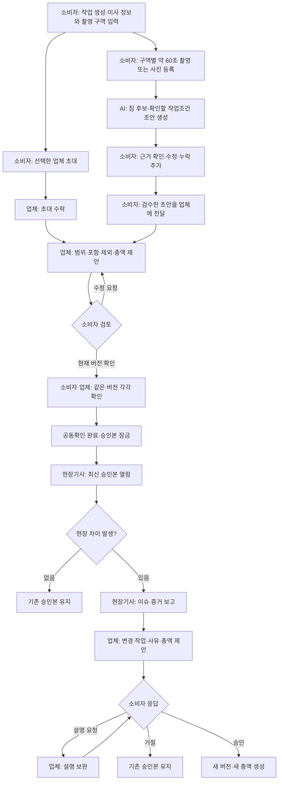

# 짐확정 프론트 제품 흐름 및 디자인 브리프

## 문서 역할

이 문서는 [PRD v2](prd-v2.md)를 프론트엔드 설계 언어로 옮긴다. P0 사용자 흐름, 역할별 목적, 화면에 필요한 정보·행동·상태와 디자인 제약을 정의한다.

페이지 수, 라우트, 탭 구조와 시각 스타일은 이 문서에서 확정하지 않는다. 먼저 아래의 제품 위계와 역할 경계를 보존한 뒤 와이어프레임과 컴포넌트를 결정한다. 실제 요청·응답 필드는 구현 시점의 백엔드 OpenAPI로 확정한다.

### 기준 자료와 우선순위

- 제품 목적·범위·수락 기준: [PRD v2](prd-v2.md)
- 문제 근거와 경쟁 맥락: [리서치](research.md)
- 시스템 불변식과 보안 경계: [아키텍처](architecture.md)
- 프론트 구현 원칙: [API 연동 규격](api-spec.md), [기술 스택](tech-stack.md)

문서 간 충돌이 있으면 제품 범위와 표현은 PRD v2를 우선한다. 로컬 API 문서나 현재 백엔드 기능이 더 넓더라도 P1·P2 기능을 P0 화면의 핵심처럼 올리지 않는다.

---

## 1. 디자인 목표

### 제품명

> 짐확정 — 소규모 이사의 쌍방 확인 견적서

### 한 줄 정의

> 방을 약 60초 촬영하면 AI가 이삿짐과 확인할 작업조건을 정리하고, 소비자와 이사업체가 “이 가격에 어디까지 옮기기로 했는지” 한 장으로 함께 확인한 뒤 당일 변경도 다시 승인하는 서비스

### 대상 사용자

초기 사용자는 서울·수도권에서 원룸·투룸 규모의 비대면 견적 이사를 준비하는 20~30대 1인 가구 소비자다.

- 이미 이사업체를 선택했거나 한 업체와 협의 중이다.
- 방문 견적 대신 사진·영상과 설명으로 짐을 전달한다.
- 여러 대화에 흩어진 작업범위와 총액을 한눈에 확인하고 싶다.
- 이사 당일 추가 작업과 금액에 휴대전화로 응답해야 할 수 있다.

구매 주체는 반복 상담과 현장 재협상 비용을 줄이려는 소형 이사업체다. 소비자 경험은 무료 참여를 전제로 하며, 여러 업체를 찾고 비교하는 마켓플레이스 경험을 만들지 않는다.

### 핵심 결과물

제품의 대표 결과물은 AI 분석 화면이나 업체 대시보드가 아니라 하나의 `공동확인 카드`다. 카드 한 화면에서 다음 내용을 이해할 수 있어야 한다.

- 현재 작업범위 버전과 생성 시각
- 출발지·도착지와 구역별 짐 항목
- 수량·분해·설치·운반 주의사항을 포함한 항목 설명
- 아직 확인이 필요한 작업조건
- 포함 작업과 제외 작업
- 기본금액, 조정 사유·금액과 총액
- 소비자와 업체의 확인 상태와 시각
- 이전 승인본과 현재 제안의 관계
- 현장 변경이 있다면 변경 사유와 변경 전후 총액

공동확인 카드는 전자계약서나 책임 인정 문서가 아니다. 양측이 같은 작업범위와 금액을 확인했다는 거래 기록이다.

### 디자인 성공 기준

디자인은 다음 결과를 직접 지원해야 한다.

| 목표 | 디자인 검증 기준 |
| --- | --- |
| AI 입력 부담 감소 | 사용자가 촬영부터 AI 초안 검수까지 막힘없이 완료한다. |
| AI 초안 검수 완료 | AI 제안·낮은 신뢰도·사용자 수정 항목을 구분하고 누락을 보정할 수 있다. |
| 동일 버전 공동확인 | 소비자와 업체가 지금 확인하는 버전과 상대 확인 상태를 오인하지 않는다. |
| 금액 오인 방지 | 기본금액, 조정 금액과 총액을 서로 혼동하지 않는다. |
| 현장 변경 처리 | 기사 보고, 업체 제안, 소비자 응답의 책임과 순서를 설명 없이 이해한다. |
| 실패 복구 | 업로드·분석·충돌 후 성공한 입력을 잃지 않고 다음 행동을 찾는다. |

---

## 2. 제품 위계와 핵심 원칙

### P0 경험의 위계

1. 촬영을 통한 빠른 입력
2. 사람이 검수하는 AI 작업범위 초안
3. 업체가 범위·포함·제외·금액을 붙인 새 제안
4. 양측이 같은 버전을 확인하는 공동확인 카드
5. 승인본을 기준으로 한 현장 차이 보고와 변경 재승인
6. 이전 승인본과 주요 행동을 확인하는 거래 이력

AI는 P0의 핵심 입력 방식이다. 수동 입력은 AI 실패나 누락을 보완하는 복구 수단이며, 촬영 없이 처음부터 별도 수동 작성 제품처럼 병렬 강조하지 않는다.

### 계속 지켜야 하는 원칙

1. **세 역할이 같은 기준을 본다.** 역할별 정보 위계는 달라도 버전·범위·총액의 의미는 같아야 한다.
2. **확인된 내용은 덮어쓰지 않는다.** 수정하면 새 버전이 생기고 이전 내용과 확인 기록은 남는다.
3. **현장 변경은 별도로 결정한다.** 현장 이슈가 기존 승인본을 즉시 바꾸지 않는다.
4. **AI는 초안만 만든다.** 가격·차량·인원·파손·책임·계약 효력을 판단하지 않는다.
5. **행동 주체를 섞지 않는다.** 기사는 사실을 보고하고, 업체는 작업과 금액을 제안하며, 소비자는 변경에 응답한다.
6. **실패해도 입력을 보존한다.** 실패 범위만 복구하고 성공한 촬영·수정 내용은 유지한다.
7. **현재 상태를 문장으로 설명한다.** 색상이나 아이콘만으로 상태와 다음 담당자를 표현하지 않는다.

### 디자인이 계속 답해야 하는 질문

- 지금 보는 것은 AI 초안, 소비자 초안, 업체 제안, 승인본 중 무엇인가?
- 현재 버전은 무엇이며 어떤 버전을 기준으로 만들어졌는가?
- 현재 범위와 총액은 무엇인가?
- 소비자와 업체 중 누가 이 버전을 확인했는가?
- 지금 행동해야 하는 역할과 다음 행동은 무엇인가?
- 수정·거절·설명 요청을 하면 기존 승인본은 어떻게 되는가?
- 현장 변경 전후 무엇과 얼마가 달라지는가?

---

## 3. 사용자와 역할 경계

| 역할 | 주요 접속 상황 | 가장 먼저 알고 싶은 것 | P0 주요 행동 | 할 수 없는 것 |
| --- | --- | --- | --- | --- |
| 소비자 | 촬영·검수하거나 업체·현장 요청에 응답할 때 | 현재 범위·총액과 내가 확인할 내용 | 작업 생성, 촬영, AI 초안 보정, 업체 초대, 제안 확인·수정 요청, 현장 변경 응답 | 업체의 작업 가능 여부 판단, 기사 대신 현장 보고 |
| 업체 담당자 | 소비자 초안을 검토하고 범위·금액을 제안할 때 | 검토할 작업과 공동확인을 막는 항목 | 초대 수락, 범위·포함·제외·금액 제안, 같은 버전 확인, 기사 초대, 현장 변경 제안·설명 | 소비자 대신 확인·변경 승인, 기사 대신 현장 사실 확정 |
| 현장기사 | 이사 전 또는 당일 현장에서 | 최신 승인 범위와 현장에서 할 수 있는 행동 | 승인본 열람, 현장 차이·증거 보고 | 금액 제안·확정, 소비자 승인 대행, 승인본 수정 |

역할마다 다음 값은 같은 의미로 표시한다.

- 작업명·이사일·출발지·도착지
- 현재 작업범위 버전과 상태
- 기본금액, 승인된 변경과 현재 총액
- 소비자·업체 확인 여부와 시각
- 현재 행동할 역할과 다음 행동
- 마지막 주요 변경 시각

역할 링크는 한 작업과 한 역할에만 접근하는 수단이다. 로그인 계정, 신원 인증, 전자서명처럼 표현하지 않는다.

---

## 4. P0 전체 사용자 흐름

### 반드시 보존할 분기

- 업체가 참여하기 전에도 소비자는 촬영과 AI 초안 검수를 진행할 수 있다. 이때 `소비자 초안·공동확인 전`임을 분명히 표시한다.
- AI 분석은 핵심 흐름이지만 실패할 수 있다. 성공한 입력을 유지하고 재시도 또는 수동 보정으로 업체 전달까지 계속한다.
- 소비자의 수정 요청은 현재 업체 제안을 직접 수정하지 않는다. 업체가 기준 버전을 바탕으로 새 제안을 만든다.
- 업체 확인과 소비자 확인은 반드시 같은 버전에 귀속한다.
- 현장 이슈는 선택적으로 발생하는 분기다. 정상 흐름의 필수 단계처럼 표현하지 않는다.
- 설명 요청과 거절은 기존 승인본과 총액을 바꾸지 않는다.
- 소비자가 승인한 변경만 새 버전과 총액에 반영한다.

### 역할 간 전달

| 보내는 역할 | 받는 역할 | 전달 내용 | 받은 역할의 다음 행동 |
| --- | --- | --- | --- |
| 소비자 | 업체 | 이사 조건과 검수한 짐 초안 | 작업범위·포함·제외·금액 검토 |
| 업체 | 소비자 | 버전이 있는 범위·금액 제안 | 확인 또는 수정 요청 |
| 업체 | 현장기사 | 최신 공동확인 승인본 | 작업 전 승인 범위 확인 |
| 현장기사 | 업체 | 승인본과 다른 현장 사실·증거 | 변경 작업·금액 제안 여부 판단 |
| 업체 | 소비자 | 현장 변경 사유·작업·금액 | 승인·거절·설명 요청 |

요청을 보낸 뒤 `전송 완료`만 보여주지 않는다. 다음 담당자가 누구이며 무엇을 기다리는지 함께 알려준다.

---

## 5. 단계별 디자인 요구사항

### 5.1 작업 생성과 역할 연결

**목적**

- 소비자가 이사 작업의 기본 맥락과 촬영 구역을 만든다.
- 이미 선택한 업체를 한 작업의 업체 담당자로 초대한다.
- 업체와 기사가 자신이 어떤 작업에 어떤 역할로 초대됐는지 이해한다.

**보여야 하는 정보**

- 이사일, 출발지·도착지 표시명
- 원룸·투룸의 촬영 구역 구성
- 현재 접속 역할과 초대한 역할
- 초대 상태와 만료 시각
- 업체 참여 여부와 `공동확인 전` 상태

**필요한 행동**

- 소비자의 작업 생성
- 촬영 구역 추가·수정
- 소비자의 업체 초대
- 업체의 초대 수락·거절
- 업체의 현장기사 초대
- 초대 폐기·재발급

**주요 상태**

- 초대 전, 대기, 수락, 거절, 만료, 폐기
- 잘못된 링크, 권한 부족, 이미 처리된 초대
- 업체 미참여·소비자 초안

미디어 수집을 시작하기 전에 이용 목적, 보관기간과 삭제 방법을 확인할 수 있어야 한다. 만료 원인을 기술적으로 설명하기보다 안전한 재초대 행동을 제공한다.

### 5.2 촬영·업로드와 AI 초안 검수

**목적**

- 소비자가 모바일에서 구역별로 약 60초 촬영하고, AI 초안을 업체에 전달할 수 있는 작업범위로 보정한다.

**보여야 하는 정보**

- 공간 목록과 공간별 촬영 진행 정도
- 약 60초 촬영을 돕는 간단한 촬영 가이드
- 파일별 업로드·처리 상태
- AI 분석 진행 상태
- 구역별 가구·가전·박스 후보
- AI 제안, 사용자 수정, 직접 추가, 확인 필요 상태
- 낮은 신뢰도 항목과 근거 미디어
- 영상으로 확정하기 어려운 엘리베이터·계단·주차·사다리차·운반거리 확인 항목

**필요한 행동**

- 사진·영상 등록과 삭제
- 실패한 파일만 다시 시도
- AI 분석 제출과 상태 재확인
- AI 항목 수정·삭제
- 누락 항목 직접 추가
- 확인 필요 항목 검토
- 실패 후 재분석 또는 수동 보정
- 검수 완료 후 업체에 전달

**주요 상태**

- 파일: 선택됨, 업로드 중, 처리 중, 준비 완료, 실패
- 분석: 제출 전, 대기, 분석 중, 완료, 실패
- 항목: AI 제안, 낮은 신뢰도, 소비자 수정, 직접 추가, 확인 완료
- 전체: 검수 전, 검수 중, 업체 전달 가능, 업체 전달 완료

AI 결과는 확정 목록처럼 보이면 안 된다. 신뢰도 수치는 보조 정보로 사용하고 `이 항목을 확인해 주세요`처럼 필요한 행동을 함께 표시한다. 재분석이 소비자가 수정한 값을 덮어쓸 수 있다면 실행 전에 영향을 설명하고 명시적 동의를 받는다.

### 5.3 업체 제안

**목적**

- 업체가 소비자 초안을 검토해 실제 수행할 작업, 포함·제외 범위와 원화 총액을 새 버전으로 제안한다.

**보여야 하는 정보**

- 기준이 된 소비자 초안 또는 이전 제안 버전
- 구역별 짐과 확인이 필요한 작업조건
- 업체가 수정·추가·제외한 내용
- 포함 작업과 제외 작업
- 기본금액, 조정 사유·금액과 총액
- 제안 버전, 작성자와 생성 시각
- 소비자·업체의 현재 확인 상태

**필요한 행동**

- 항목과 작업 설명 검토·수정
- 포함·제외 작업 작성
- 기본금액과 조정 항목 입력
- 합계 검증
- 새 버전 제안 전송
- 소비자 수정 요청을 반영한 후속 제안 생성
- 현재 제안에 대한 업체 확인

**주요 상태**

- 업체 참여 전, 검토 중, 제안 작성 중
- 소비자 확인 대기
- 수정 요청됨
- 후속 제안 생성 필요
- 다른 곳에서 새 버전이 생긴 충돌

P0에서는 항목별 정교한 자동 diff보다 현재 제안과 기준 버전의 관계, 주요 변경 요약과 이전 버전 접근을 우선한다. 추가·삭제·수정 필드를 한 화면에서 자동 비교하는 기능은 P1이다.

### 5.4 공동확인 카드와 승인본

**목적**

- 소비자와 업체가 같은 범위·포함·제외·총액을 한 화면에서 검토한다.
- 같은 버전에 대한 양측 확인이 완료되면 더 이상 수정할 수 없는 승인본으로 구분한다.

**정보 위계**

1. 현재 상태와 다음 행동
2. 버전과 양측 확인 상태
3. 총액과 조정 내역
4. 포함·제외 작업
5. 구역별 짐과 확인 조건
6. 이전 버전과 주요 이력

**필요한 행동**

- 소비자의 현재 버전 확인
- 소비자의 사유가 있는 수정 요청
- 업체의 현재 버전 확인
- 이전 버전 열람
- 승인본 이후 변경이 필요할 때 새 제안 흐름으로 이동

**주요 상태**

- 업체 확인 전
- 업체 확인·소비자 확인 대기
- 소비자 확인·업체 확인 대기
- 수정 요청됨
- 공동확인 완료·잠김
- 과거 승인본
- 최신이 아닌 버전

확인 CTA 주변에는 버전, 총액과 `내용 확인 기록이며 결제·전자서명이 아닙니다`라는 의미를 명확히 배치한다. 서로 다른 버전의 확인 상태를 합쳐서 보여주지 않는다.

### 5.5 현장기사 승인본 열람

**목적**

- 현장기사가 이사 시작 전 최신 승인본의 범위와 조건을 빠르게 확인한다.

**보여야 하는 정보**

- 이사일과 출발지·도착지 요약
- 최신 승인본 버전과 공동확인 시각
- 구역별 짐과 작업 설명
- 포함·제외 작업
- 주의사항과 아직 현장에서 확인할 조건
- 현재 총액은 참고 정보로 보여주되 기사 행동과 분리
- 이전 승인본이 아닌 최신 버전이라는 상태

**필요한 행동**

- 구역별 승인 범위 열람
- 제한 시간의 근거 미디어 열람
- 승인본과 다른 사실이 있을 때 현장 이슈 보고 시작

**주요 상태**

- 승인본 준비 전
- 최신 승인본 열람 가능
- 승인본 변경됨·새로고침 필요
- 링크 만료·폐기, 권한 부족

기사 화면은 관리 대시보드가 아니라 `오늘 옮기기로 확인된 것`과 `다르면 보고하기`에 집중한다. P0에는 차량·인력 후보 비교, 배차 최적화와 근무시간 관리 화면을 포함하지 않는다.

### 5.6 현장 이슈와 변경 재승인

**목적**

- 현장기사가 승인본과 다른 사실을 증거와 함께 보고한다.
- 업체가 그 사실을 작업·금액 변경안으로 만든다.
- 소비자가 기존 승인본과 변경 후 결과를 비교해 결정한다.

**현장기사 경험**

- 기준 승인본 버전
- 현장 차이의 제목·설명
- 필수 증거 등록과 업로드 상태
- 제출 전 `금액을 정하는 보고가 아님`을 이해할 수 있는 문구
- 제출 후 업체 처리 상태와 다음 담당자

**업체 경험**

- 현장기사의 설명과 증거
- 기준 승인본의 관련 항목과 기존 총액
- 추가·제외·변경 작업
- 증감 사유, 증감액과 변경 후 총액
- 고객에게 변경 제안 전송
- 설명 요청에 대한 한 번의 보완 설명

**소비자 경험**

- 무엇이 왜 달라졌는지
- 현장 증거와 기준 승인본의 관련 내용
- 기존 총액, 증감액, 변경 후 총액
- 승인, 거절, 설명 요청
- 거절·설명 요청 사유
- 각 선택이 기존 승인본에 미치는 영향

**주요 상태**

- 현장 이슈 작성·업로드 중
- 업체 검토·변경안 작성 중
- 소비자 응답 대기
- 설명 요청됨
- 설명 보완됨
- 승인·새 버전 생성
- 거절·기존 승인본 유지
- 다른 담당자가 먼저 처리함
- 기준 버전이 바뀐 충돌

`현장 보고 → 업체 제안 → 소비자 응답`의 책임을 한 CTA나 한 화면에서 섞지 않는다. 승인 행동 주변에는 기준 버전과 변경 전후 금액을 항상 함께 보여준다.

### 5.7 버전과 행동 이력

**목적**

- 사용자가 현재 승인본과 과거 기록을 구분하고 주요 행동의 주체·대상·시각을 확인한다.

**P0에서 보여야 하는 이력**

- 버전 번호·상태·작성 역할·생성 시각
- 각 버전이 기준으로 삼은 이전 버전
- 소비자·업체 확인 역할과 시각
- 현장 이슈, 변경 제안과 소비자 응답의 순서
- 승인된 변경으로 만들어진 새 버전

P0 이력은 운영용 전체 감사 로그가 아니다. 사용자가 현재 범위와 변경 경위를 이해하는 데 필요한 거래 기록만 제공한다.

---

## 6. 화면 위계와 반응형 원칙

### 역할별 첫 진입점

| 역할 | 첫 화면이 답해야 하는 질문 | 우선 정보 |
| --- | --- | --- |
| 소비자 | 지금 촬영·검수·확인할 것은 무엇인가? | 현재 작업, 다음 행동, 촬영·AI 상태, 최신 범위·총액, 업체 참여 상태 |
| 업체 담당자 | 지금 검토하거나 제안할 것은 무엇인가? | 처리할 작업, 소비자 초안, 현재 제안, 공동확인·현장 이슈 상태 |
| 현장기사 | 오늘 무엇을 옮기기로 했고 다르면 어떻게 하는가? | 최신 승인본, 포함·제외, 주의사항, 현장 이슈 보고 |

### 화면에서 유지할 작업 맥락

- 작업명 또는 작업 코드
- 이사일과 현재 단계
- 출발지·도착지 요약
- 현재 접속 역할
- 현재 버전과 문서 상태
- 양측 확인 상태
- 기준 금액과 현재 총액
- 현재 행동할 역할과 대표 행동
- 마지막 상태 변경 시각

### 기본 정보 위계

1. 작업 맥락
2. 현재 상태와 다음 행동
3. 판단에 필요한 핵심 내용
4. 대표 행동
5. 기록과 보조 정보

모든 정보를 동일한 카드로 나열하지 않는다. 관련 정보는 사용자의 판단 순서에 따라 한 덩어리로 묶는다.

### 반응형 기준

- 소비자의 촬영·검수·확인·변경 응답은 모바일 세로 화면을 기준으로 설계한다.
- 현장기사의 승인본 열람·증거 등록은 한 손 사용과 현장 이동을 고려한다.
- 핵심 과업은 가로 스크롤 없이 완료한다.
- 업체 화면은 모바일과 데스크톱에서 같은 업무 의미를 유지한다. 데스크톱에서는 목록·상세 병렬 배치를 허용하되 모바일에서 기능이 빠지지 않는다.
- 하단 고정 CTA는 현재 판단 내용과 겹치지 않아야 하며 키보드·안전 영역을 고려한다.

---

## 7. 반복 UI 패턴

| 패턴 | 사용 목적 | 필수 내용 |
| --- | --- | --- |
| 상태 요약 | 현재 위치와 다음 행동 안내 | 현재 단계, 기다리는 역할, 마지막 변경 시각 |
| 작업 헤더 | 작업 맥락 유지 | 작업 코드, 이사일, 출·도착 요약, 접속 역할 |
| 공간별 촬영 목록 | 촬영 누락 방지 | 공간, 촬영 유무, 파일 처리 상태 |
| 미디어 업로더 | 촬영·현장 증거 등록 | 파일별 상태, 실패 항목 재시도, 삭제 |
| AI 검수 목록 | 소비자 초안 보정 | 출처, 낮은 신뢰도, 수정·삭제·추가·확인 |
| 공동확인 카드 | 제안과 승인본의 단일 결과물 | 버전, 범위, 포함·제외, 금액, 양측 상태 |
| 버전 표지 | 문서 상태 구분 | 버전, 작성자, 생성 시각, 기준 버전, 현재·과거 여부 |
| 금액 요약 | 금액 오인 방지 | 기본금액, 조정 사유·금액, 총액 |
| 변경 전후 비교 | 현장 변경 결정 | 기존 총액, 증감액, 변경 후 총액, 변경 작업 |
| 증거 보기 | AI 근거·현장 변경 확인 | 실제 미디어, 관련 공간·항목·사유, 로드 실패 |
| 사유 입력 | 수정·설명 요청·거절 | 선택한 행동, 필수 사유, 제출 영향 |
| 충돌 복구 | 동시 변경 처리 | 바뀐 내용, 보존된 입력, 최신 버전 보기 |
| 거래 이력 | 변경 경위 이해 | 버전·확인·이슈·제안·응답의 주체와 시각 |

판단에 필요한 내용과 비교가 길면 전체 화면이나 상세 영역을 사용한다. 짧은 사유 입력과 단일 선택은 현재 맥락을 유지하는 바텀시트로 처리할 수 있다.

---

## 8. 공통 상태와 복구 원칙

| 상태 | 알려야 하는 것 | 제공할 행동 |
| --- | --- | --- |
| 로딩 | 무엇을 불러오는지 | 기존 작업 맥락 유지 |
| 비어 있음 | 아직 없는 정보와 이유 | 촬영·초대·제안 등 다음 행동 |
| 제출 중 | 처리 중인 행동과 대상 버전 | 중복 제출 차단 |
| 성공 | 기록된 결과와 다음 담당자 | 다음 단계 또는 결과 보기 |
| 실패 | 보존된 입력과 실패 범위 | 재시도 또는 수동 보정 |
| 일부 실패 | 실패한 파일·항목 | 실패한 항목만 재시도 |
| 충돌 | 다른 곳에서 바뀐 버전·상태 | 입력 보존, 최신 버전 비교 |
| 만료·폐기 | 더 이상 접근할 수 없는 이유 | 초대한 역할을 통한 재초대 안내 |
| 권한 부족 | 현재 역할로 할 수 없는 행동 | 허용된 화면으로 이동 |
| 오프라인 | 최신 정보 여부와 제한되는 행동 | 재연결, 마지막 확인 시각 |

### 제출과 확인 규칙

- 버전·범위·금액·확인은 서버 성공 응답 전에 완료된 것처럼 표시하지 않는다.
- 제출 중에는 같은 행동을 반복할 수 없게 한다.
- 성공 여부가 불분명하면 재제출 전에 최신 상태를 조회한다.
- 충돌이 발생해도 작성 중인 설명과 금액 입력을 보존한다.
- 오류 원문이나 provider 정보를 노출하지 않고 사용자가 취할 행동을 설명한다.
- 상태는 색상뿐 아니라 제목·문장·아이콘과 가능한 행동으로 구분한다.

### 개인정보와 미디어

- 집 내부 미디어는 일반 공개 콘텐츠처럼 다루지 않는다.
- 제한 시간 미디어가 만료되면 새로 불러오는 행동을 제공하고 영구 URL처럼 복사·저장하도록 유도하지 않는다.
- 현재 역할에 허용되지 않은 미디어와 다른 작업의 존재를 화면에서 추측할 수 없게 한다.
- 역할 비밀값과 미디어 URL을 화면 URL, 영구 저장소, 분석 이벤트나 오류 메시지에 노출하지 않는다.

---

## 9. 범위 경계

### P0에 포함

- 소비자 시작형 작업 생성
- 이사일·출발지·도착지·촬영 구역 입력
- 약 60초 촬영·사진 등록과 처리 상태
- AI 초안, 근거·불확실성 표시와 수동 보정
- 업체 초대·참여
- 업체의 범위·포함·제외·원화 총액 제안
- 같은 버전의 소비자·업체 확인
- 공동확인 카드와 잠긴 승인본
- 현장기사의 최신 승인본 열람
- 현장 이슈·증거, 업체 변경 제안과 소비자 응답
- 주요 버전·확인·변경 이력

### P1로 분리

- 수량·단위·분해·설치·포장·주의사항의 독립 구조화 필드
- 층·엘리베이터·계단·주차·차량 접근·운반거리의 구조화
- 촬영 누락·흔들림·중복 자동 품질 안내
- 항목 단위의 정교한 버전 diff
- 완료 미디어와 양측 완료 확인
- PDF 결과물과 외부 알림

### P2로 분리

- 전후 영상의 파손 의심 지점 표시
- 업체 운영 통계
- 이사 플랫폼 API 연동

### 만들지 않는 것

- 이사업체 검색·추천·다중 견적 비교
- 자동 가격·적정가격 판정
- 차량·인원 자동 결정과 전체 배차 관리
- 결제·에스크로·현금영수증
- 파손·책임·법적 분쟁 자동 판정
- 전자계약·전자서명으로 오해할 경험
- 보험·보상 중재
- 자체 채팅·전화·지도·내비게이션
- 별도 알림함과 읽음 처리
- 전체 감사 로그와 운영 도구
- AI 모델·프롬프트 관리

백엔드에 P1 기능이 구현돼 있더라도 P0의 핵심 가설을 가리지 않도록 기본 탐색과 첫 화면에서 분리한다.

---

## 10. 콘텐츠와 표현 원칙

### 권장 표현

- `이 가격에 어디까지 옮기기로 했는지 함께 확인해요.`
- `AI가 찾은 초안을 확인하고 빠진 짐을 추가해 주세요.`
- `업체가 제안한 버전 3을 확인하고 있어요.`
- `소비자 확인을 기다리고 있어요.`
- `기존 승인본은 유지됩니다.`
- `승인하면 변경 내용이 새 버전과 총액에 반영됩니다.`

### 사용하지 않는 표현

- 추가금이나 분쟁이 발생하지 않습니다.
- AI가 모든 짐과 작업조건을 정확히 찾았습니다.
- AI가 적정 이사 가격을 계산했습니다.
- 계약이 체결되었습니다.
- 전자서명이 완료되었습니다.
- 법적 효력이 있는 견적서입니다.
- 파손 책임이 확인되었습니다.

`확정`, `승인`, `확인`은 문맥을 구분해 사용한다. 제품 핵심 결과는 `공동확인 완료`와 `승인본`으로 표현하되, 법적 계약·결제·책임 확정이 아니라 같은 내용을 확인한 기록임을 가까운 위치에서 설명한다.

---

## 11. 출시 전 디자인 점검

- 첫 진입에서 촬영 기반 AI 입력이 제품의 주 흐름으로 보이는가?
- 업체 미참여 소비자 초안이 승인본처럼 보이지 않는가?
- AI 결과가 수정 가능한 초안이며 근거와 불확실성을 확인할 수 있는가?
- AI 실패 후 성공한 입력을 유지한 채 재시도·수동 보정할 수 있는가?
- 공동확인 카드에서 범위, 확인 항목, 포함·제외, 총액, 버전과 양측 상태를 한 화면에서 이해할 수 있는가?
- 현재 확인하는 버전과 상대가 확인한 버전을 오인하지 않는가?
- 승인본이 같은 버전 안에서 편집 가능한 것처럼 보이지 않는가?
- 기본금액, 조정 금액, 기존 총액과 변경 후 총액을 혼동하지 않는가?
- 기사가 최신 승인본만 현재 합의로 인식하는가?
- 기사 보고, 업체 변경 제안, 소비자 응답의 책임이 분리되는가?
- 거절·설명 요청 시 기존 승인본이 유지됨을 알 수 있는가?
- 소비자 승인 전 현장 변경이 새 범위나 총액에 반영된 것처럼 보이지 않는가?
- 실패·충돌·만료 후에도 보존된 내용과 다음 행동을 찾을 수 있는가?
- 모바일에서 촬영, 검수, 확인과 변경 응답을 가로 스크롤 없이 완료하는가?
- 상태가 색상만이 아니라 문장과 행동으로 전달되는가?
- 역할 링크와 집 내부 미디어를 신원 인증·공개 자산처럼 취급하지 않는가?
- P1·P2 또는 제외 기능이 P0 핵심 흐름보다 앞서 보이지 않는가?
- 가격·파손·책임·법적 효력을 자동 확정하는 표현이 없는가?

이 항목을 만족한 뒤 화면 목록, 라우트, 탭 구조, 컴포넌트와 시각 토큰을 확정한다.
