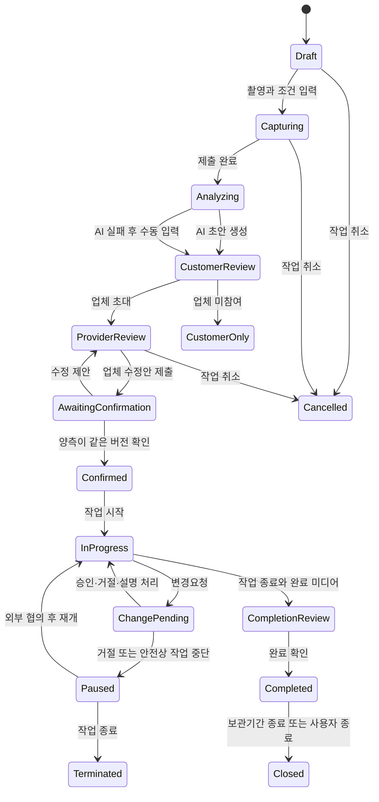

# 이사 작업범위 공동확인 서비스 Product Requirements Document

> 버전: v0.1
> 
> 
> 기준일: 2026-08-09
> 
> 제품 단계: 해커톤 MVP
> 
> 문서 상태: 제품 결정 반영 초안 / 법률·개인정보·실사용 검증 전 / 출시 미승인
> 
> 서비스 지역: 대한민국
> 
> 서비스 형태: 소비자 중심 무료 반응형 웹·PWA
> 
> 기준 자료: 시장·해커톤·사업성 검증, 무코드 Concierge PoC 키트, 개념 ERD와 시스템 아키텍처
> 

## 0. 문서 권한과 해석 원칙

이 문서는 업체 선택을 마친 소비자가 계약을 최종 확정하기 전에 이삿짐과 작업조건을 기록하고, 소비자·업체가 같은 작업범위와 총액을 공동확인하며, 이사 당일 변경도 다시 합의하도록 만드는 해커톤 MVP의 최상위 제품 기준이다.

- 본 문서와 기존 자료가 충돌하면 본 문서의 결정이 우선한다.
- 요구사항의 `MUST`는 MVP의 핵심 제품 약속, `SHOULD`는 합리적 예외가 없으면 제공할 기능, `MAY`는 핵심 흐름을 훼손하지 않을 때만 제공할 기능이다.
- 본 MVP는 전자계약·전자서명 기능을 제공하지 않는다. 확인 기록의 법적 효력, 계약 성립, 추가금의 정당성 또는 책임을 서비스가 판단하거나 보장하지 않으며 실제 계약은 당사자가 별도로 체결한다.
- AI 결과는 사람이 수정해야 하는 초안이다. 가격, 차량·인원, 파손, 책임, 계약 효력을 자동 판단하지 않는다.
- 완료 사진·영상은 작업 전후 기록을 사람이 나란히 확인하기 위한 자료다. 자동 파손 탐지나 책임 판정에 사용하지 않는다.
- 이 문서는 출시 승인이 아니다. 실제 개인정보를 처리하기 전에 개인정보·전자문서·계약 관련 법률 검토와 보안 검토가 필요하다.

---

## 1. 제품 정의

### 1.1 제품 목표

> **소비자가 선택한 이사업체와 계약을 확정하기 전에 방·구역별 짐과 작업조건, 포함범위, 총액을 하나의 버전 카드로 공동확인하고, 이사 당일 달라진 작업도 사유와 금액을 다시 승인하게 해 미합의 현장 추가금을 줄인다.**
> 

### 1.2 한 줄 소개

> 영상으로 만든 이삿짐 초안을 소비자와 업체가 함께 고치고, 합의한 범위와 당일 변경을 한 카드에 남기는 무료 서비스
> 

### 1.3 해결하려는 문제

이사 계약 전 전화·메신저·사진으로 흩어진 정보는 현장기사에게 동일하게 전달되지 않기 쉽다. 그 결과 다음 상황이 생긴다.

- 소비자는 계약금액에 어떤 짐과 작업이 포함됐는지 현장에서 즉시 확인하기 어렵다.
- 업체는 촬영되지 않았거나 상담 중 빠진 짐·접근조건 때문에 인력과 차량 계획이 달라질 수 있다.
- 현장기사는 고객·상담자가 합의한 최신 범위를 보지 못할 수 있다.
- 당일 추가 작업이 생겼을 때 사유, 증거, 금액, 승인 여부가 서로 다른 카카오톡과 구두 대화에 남는다.
- 사후에는 원래 합의와 당일 변경을 한 흐름으로 재구성하기 어렵다.

제품은 추가비용 자체를 금지하지 않는다. 정당한 추가 작업이라도 사전에 합의한 범위와 무엇이 다른지 보여주고, 금액을 다시 승인받게 만드는 것이 목적이다.

### 1.4 핵심 가치

1. 소비자는 계약 전에 자신이 **무엇에 얼마를 합의하는지** 확인한다.
2. 업체는 누락된 짐과 작업조건을 현장 전에 발견하고 수정한다.
3. 현장기사는 승인된 최신 작업범위를 작업 시작 전에 확인한다.
4. 당일 변경은 구두 요구가 아니라 기준 버전, 사유, 증거, 금액과 응답 상태로 남는다.
5. 완료 후에는 작업 전·완료 사진과 영상을 사람이 나란히 확인할 수 있다.

### 1.5 차별화 가설

영상 인벤토리와 전자확인은 해외 서비스에도 존재한다. 이 제품의 검증 대상 차별화는 다음 결합이다.

- 업체 추천이나 견적 비교가 아닌 특정 거래의 단일 작업범위 원장
- 소비자·업체 담당자·현장기사가 같은 버전을 보는 역할 기반 흐름
- 국내 주거 이사에 맞춘 짐, 접근조건, 포장, 분해·조립, 포함·제외, 차량·인원 필드
- 현장 변경의 사유·증거·금액·승인 상태와 새 버전 기록
- 소비자가 먼저 생성해 이미 선택한 업체를 초대하는 중립적 무료 서비스

이는 검증 전 가설이며, 독립적으로 확인된 경쟁우위라고 표현하지 않는다.

---

## 2. 목표, 비목표, 성공 정의

### 2.1 MVP 목표

- 방·구역별 영상에서 수정 가능한 이삿짐 초안을 생성한다.
- 출발지와 도착지의 작업조건을 구조화해 기록한다.
- 소비자와 업체가 같은 카드의 같은 버전을 각각 확인한다.
- 확인이 끝난 버전을 덮어쓰지 않고 이후 변경을 새 버전으로 남긴다.
- 현장 추가 작업에 사유, 증거, 증감액을 붙여 소비자의 응답을 받는다.
- 완료 사진·영상을 작업 전 자료와 나란히 열람할 수 있게 한다.
- 미합의 추가금 경험률을 측정할 최소 이벤트와 사후 질문을 남긴다.

### 2.2 MVP 비목표

다음은 구현하거나 제품 메시지로 약속하지 않는다.

- AR 공간 측정
- 자동 파손 탐지, 파손 전후 자동 비교, 책임 주체 판정
- OTP, 실명 인증, 사업자 인증, 법적 전자서명
- 자동 가격 계산, 적정가격 판정, 부피·차량·인원 자동 산정
- 업체 추천, 견적 비교, 예약 중개, 결제, 에스크로
- 보험 청구, 분쟁 조정, 법률 판단, 보상 지급
- 네이티브 앱, 오프라인 승인, 카카오톡·SMS 자동발송
- 사무실·기업·해외이사, 택배, 보관 전용, 셀프이사 관리

### 2.3 제품 약속의 표현

허용되는 표현:

> 합의한 작업범위와 당일 변경을 한곳에 남겨 미합의 현장 추가금을 줄이기 위한 서비스
> 

검증 전 금지되는 표현:

- 추가금이 절대 발생하지 않는다.
- 모든 짐을 AI가 정확히 찾는다.
- 이 카드가 계약서와 같은 법적 효력을 가진다.
- 완료 영상으로 파손과 책임을 판정한다.
- 이 서비스를 쓰면 분쟁이 감소한다.

실제 비교 데이터가 확보되기 전에는 `감소시킨다`가 아니라 `줄이기 위한`, `기록을 돕는`으로 표현한다.

---

## 3. 대상 사용자와 적용 범위

### 3.1 서비스 이용 대상

국내 주거 이사를 이사업체에 맡기고, 업체를 이미 선택했으나 작업범위와 최종 계약을 확정하기 전인 성인 소비자를 대상으로 한다.

서비스와 데이터 구조는 다음 주거 형태를 모두 고려해야 한다.

- 원룸·투룸
- 오피스텔
- 아파트
- 연립·다세대·빌라
- 단독·다가구·전원주택
- 복층·다층 주거

가구원 수, 짐의 양, 포장이사 여부로 이용 자격을 제한하지 않는다.

### 3.2 초기 검증 범위

초기 PoC도 1인 가구만을 대표 사용자로 고정하지 않는다. 최소 5건의 검증 작업을 다음과 같이 서로 다른 주거 형태로 구성한다.

| 검증 슬롯 | 출발지 또는 도착지의 대표 주거 형태 | 반드시 확인할 조건 |
| --- | --- | --- |
| 1 | 원룸·투룸 | 좁은 동선, 박스 수량 변동 |
| 2 | 오피스텔 | 엘리베이터 예약, 주차·상하차 위치 |
| 3 | 아파트 | 엘리베이터·사다리차·관리규정 |
| 4 | 연립·다세대·빌라 | 계단, 주차, 장거리 운반 |
| 5 | 단독·다가구·복층 | 층간 이동, 큰 가구 동선, 다수 구역 |

이 표본은 시장 전체를 통계적으로 대표하지 않는다. 주거 형태에 따라 필요한 입력 필드와 촬영 UX가 누락되지 않았는지 확인하기 위한 최소 설계 표본이다.

### 3.3 현재 대상이 아닌 사용자

- 이사업체를 아직 선택하지 않아 추천이나 비교가 필요한 소비자
- 사업자 간 사무실·창고·공장 이전을 진행하는 사용자
- 해외이사, 택배, 보관 전용, 셀프이사만 필요한 사용자
- 법적 분쟁의 책임 판단이나 보상 결정을 서비스에 요구하는 사용자
- 계약 권한이 없는 미성년자 또는 무권한 제3자

### 3.4 참여 역할

| 역할 | 핵심 과업 | MVP 권한 |
| --- | --- | --- |
| 소비자 | 작업 생성, 촬영·조건 입력, AI 초안 검수, 카드 수정·확인, 변경 응답, 완료 기록 | 전체 작업 열람·수정 제안·확인·삭제 요청 |
| 업체 담당자 | 짐·조건 검토, 차량·인원·포장·총액 입력, 카드 수정·확인 | 초대된 작업 열람·수정 제안·확인 |
| 현장기사 | 작업 전 최신 승인본 확인, 당일 변경요청, 완료 기록 보조 | 승인본 열람·변경요청·완료 미디어 제출 |
| 내부 운영자 | 기술 오류와 삭제 요청 처리 | 최소한의 작업 상태·삭제 도구만 사용 |

업체 담당자와 현장기사는 MVP에서 사업자·실명 인증을 거치지 않는다. 화면에는 `소비자가 초대한 참여자`임을 명시한다.

---

## 4. 핵심 사용자 여정

### 4.1 정상 흐름

1. 소비자가 작업을 생성한다.
2. 이사일, 출발지·도착지 주거 형태와 기본 조건을 입력한다.
3. 출발지의 방·구역별 짧은 영상과 조건 사진을 제출한다.
4. 도착지는 영상을 요구하지 않고 층·엘리베이터·계단·주차·운반거리 답변을 필수로 받는다. 사진은 선택이다.
5. AI가 공간별 이삿짐 초안과 `확인 필요` 항목을 만든다.
6. 소비자가 AI 초안을 먼저 검수해 업체에 보낼 초안을 만든다.
7. 소비자가 선택한 업체 담당자에게 작업 링크를 공유한다.
8. 업체 담당자가 짐·조건·포장·분해조립·차량·인원·포함·제외·총액을 수정한다.
9. 소비자와 업체가 같은 버전을 각각 확인한다.
10. 현장기사가 작업 시작 전 최신 승인본을 연다.
11. 현장에서 범위 차이가 발견되면 기사가 사유·증거·추가 작업·금액을 등록한다.
12. 소비자가 승인, 거절 또는 설명 요청을 선택한다.
13. 승인된 변경은 새 작업범위 버전에 반영된다.
14. 작업 완료 후 소비자 또는 현장기사가 완료 사진·영상을 제출한다.
15. 소비자는 작업 전 자료와 완료 자료를 나란히 보고 완료 여부와 미합의 추가금 경험을 응답한다.

### 4.2 업체가 참여하지 않는 흐름

- 소비자는 AI 초안과 수동 수정으로 소비자 단독 카드를 만들 수 있다.
- 소비자 단독 카드는 `업체 미참여`, `공동확인 전` 상태를 명확히 표시한다.
- 단독 카드를 출력하거나 링크로 전달할 수 있지만 `합의 완료` 또는 `승인본`이라고 표시하지 않는다.
- 업체가 나중에 참여하면 단독 초안을 기준으로 업체 검토 흐름을 시작한다.

### 4.3 AI 분석 실패 흐름

- 분석 실패는 작업 실패로 취급하지 않는다.
- 사용자는 사진+체크리스트 또는 직접 입력으로 품목을 추가할 수 있다.
- 실패한 AI 결과와 사람이 입력한 항목을 구분해 기록한다.
- 재시도는 가능하지만, 재시도 결과가 사용자의 수정을 자동으로 덮어쓰지 않는다.

---

## 5. 상태와 버전 모델

### 5.1 작업 상태



업체·기사 초대 상태는 작업 상태와 분리해 `PENDING`, `ACCEPTED`, `DECLINED`, `EXPIRED`, `REVOKED`로 관리한다. 완료 확인이 한쪽만 끝났거나 한쪽이 응답하지 않은 작업은 `CompletionReview`에 남기고 양측 완료로 표시하지 않는다.

### 5.2 작업범위 버전 규칙

1. 모든 작업범위 카드는 정수 버전 번호를 가진다.
2. 한쪽의 수정 제안은 새 초안 버전을 만들고 기존 확인을 무효화한다.
3. 소비자와 업체가 같은 버전을 확인해야 `CONFIRMED`가 된다.
4. `CONFIRMED` 버전의 본문, 총액, 포함·제외 범위는 덮어쓰지 않는다.
5. 확인 이후 수정은 이전 버전을 부모로 하는 새 버전에서만 가능하다.
6. 승인된 당일 변경은 새 버전을 만들고 변경요청과 결과 버전을 연결한다.
7. 모든 버전은 작성자, 생성시각, 부모 버전, 변경 요약, 확인자와 확인시각을 가진다.
8. 동시에 같은 초안을 수정하면 최신 버전 번호를 확인해 충돌을 알리고 자동 덮어쓰지 않는다.
9. 한 작업에는 확인을 기다리는 활성 제안 버전을 하나만 둔다.
10. 확인 버튼의 이름은 `서명`이나 `계약 확정`이 아니라 `이 버전 내용 확인`을 사용한다.

### 5.3 변경요청 상태

| 상태 | 의미 |
| --- | --- |
| `PENDING` | 소비자 응답 대기 |
| `EXPLANATION_REQUESTED` | 소비자가 추가 설명을 요청함 |
| `APPROVED` | 소비자가 증감액과 변경 작업을 승인함 |
| `REJECTED` | 소비자가 변경 작업과 금액을 거절함 |
| `CANCELLED` | 업체·기사가 요청을 철회함 |
| `EXPIRED` | 작업 종료 또는 응답기한 경과로 더 이상 응답할 수 없음 |

변경요청을 거절해도 기존 승인 범위는 유지된다. 이후 협상이나 작업 중단 여부는 당사자가 서비스 밖에서 결정하며, 서비스는 해당 결정을 법적으로 해석하지 않는다.

설명 요청 또는 변경 내용 수정이 발생하면 기존 요청을 덮어쓰지 않고 요청 리비전을 생성한다. 설명 요청 중에는 총액과 승인본을 바꾸지 않는다.

---

## 6. 작업범위 카드 정보 구조

### 6.1 거래 정보

- 작업 ID
- 이사 예정일시
- 출발지·도착지의 마스킹된 주소와 주거 형태
- 이사 유형: 일반·반포장·포장·기타
- 소비자 표시명
- 업체명·담당자 표시명
- 현장기사 표시명
- 작업 상태와 현재 버전

### 6.2 출발지·도착지 작업조건

각 위치는 다음 필드를 가진다.

- 주거 형태
- 층수
- 엘리베이터 유무·크기·예약 필요 여부·모름
- 계단 작업 여부·모름
- 차량 진입·주차·상하차 위치·모름
- 차량에서 출입구까지 예상 운반거리·모름
- 사다리차 또는 별도 장비 필요 여부·업체 확인 필요
- 큰 가구 이동 동선의 제약
- 관리사무소 예약·작업 가능시간·소음 규정
- 기타 현장 조건
- 조건 사진과 설명

계약 전 도착지 영상은 필수가 아니다. 위 구조화 답변은 필수이며, 알 수 없는 항목은 임의 값 대신 `모름·업체 확인 필요`로 저장한다.

### 6.3 공간별 물품

| 필드 | 설명 |
| --- | --- |
| 공간·구역 | 침실, 거실, 주방, 베란다, 창고, 복층 등 사용자 정의 가능 |
| 물품명 | 사람이 이해하는 일반 명칭 |
| 수량 | 확정 수량 또는 범위 |
| 분해·조립 | 불필요·분해만·조립만·분해와 조립·확인 필요 |
| 포장 주체 | 소비자·업체·협의 필요 |
| 주의사항 | 크기, 무게, 유리, 가전 분리 등 사람이 입력한 메모 |
| 포함 여부 | 포함·제외·협의 필요 |
| 확인 상태 | AI 초안·소비자 확인·업체 확인·확인 필요 |
| 근거 | 영상 구역·시점 또는 사진 연결 |

### 6.4 작업과 금액

- 차량 종류·대수: 업체 수동 입력
- 작업인원: 업체 수동 입력
- 포장 유형과 포장재 제공 주체
- 분해·조립 작업
- 가전 탈부착·설치 포함 여부
- 폐기·정리·청소 등 부가 작업 포함 여부
- 명시적 포함 서비스
- 명시적 제외 서비스
- 추가요금이 가능하다고 사전에 합의한 사유
- 기준 총액: 사람이 직접 입력한 원화 금액
- 가격 설명 또는 주의사항

제품은 위 항목을 이용해 가격을 산출하거나 적정성을 판정하지 않는다.

### 6.5 확인 정보

- 버전 번호와 생성시각
- 직전 버전 대비 변경 요약
- 소비자 확인 상태·시각
- 업체 확인 상태·시각
- 확인 후 잠금시각
- 확인 철회·취소 기록
- 버전 본문의 무결성 확인값

---

## 7. 기능 요구사항

### 7.1 작업 생성과 참여

| ID | 우선순위 | 요구사항 | 수락 기준 |
| --- | --- | --- | --- |
| JOB-001 | MUST | 소비자는 회원가입 없이 새 작업을 만들 수 있어야 한다. | 생성 완료 시 고유 작업 ID와 소비자 전용 비밀 링크가 발급된다. |
| JOB-002 | MUST | 소비자는 이사일, 출·도착 주거 형태와 필수 조건을 입력해야 한다. | 필수 조건이 비어 있거나 `모름`으로 표시되지 않으면 제출할 수 없다. |
| INV-001 | MUST | 소비자는 업체 담당자 링크를 생성·복사·폐기·재발급할 수 있어야 한다. | 폐기된 링크는 더 이상 작업을 열 수 없다. |
| INV-002 | MUST | 업체 미참여 상태를 승인 완료와 구분해야 한다. | 업체 확인 전 화면과 출력물에 `공동확인 전`이 지속 표시된다. |
| CREW-001 | MUST | 업체는 현장기사용 링크를 발급할 수 있어야 한다. | 기사 링크는 승인본 열람과 변경요청만 허용한다. |

### 7.2 촬영과 업로드

| ID | 우선순위 | 요구사항 | 수락 기준 |
| --- | --- | --- | --- |
| CAP-001 | MUST | 출발지는 방·구역별 15~30초 영상 촬영 흐름을 제공해야 한다. | 사용자가 구역을 추가하고 각 구역의 촬영 완료 여부를 확인할 수 있다. |
| CAP-002 | MUST | 도착지는 계약 전 영상을 요구하지 않아야 한다. | 영상 없이 구조화 조건 답변만으로 다음 단계로 이동할 수 있다. |
| CAP-003 | MUST | 도착지의 층·엘리베이터·계단·주차·운반거리 답변을 받아야 한다. | 각 필드는 값 또는 `모름·업체 확인 필요` 중 하나를 가진다. |
| CAP-004 | SHOULD | 출·도착 조건 사진을 선택적으로 첨부할 수 있어야 한다. | 사진이 없어도 제출 가능하며 사진이 있으면 위치·조건과 연결된다. |
| CAP-005 | MUST | 업로드 실패 후 재시도와 수동 입력 대체경로를 제공해야 한다. | 업로드 실패가 이미 입력한 텍스트와 완료된 파일을 지우지 않는다. |

### 7.3 AI 초안

| ID | 우선순위 | 요구사항 | 수락 기준 |
| --- | --- | --- | --- |
| AI-001 | MUST | 출발지 영상을 비동기로 분석해 공간별 품목 초안을 만들어야 한다. | 분석 중·완료·실패 상태가 표시되고 사용자는 페이지를 다시 열어 상태를 확인할 수 있다. |
| AI-002 | MUST | 각 항목에 수량, 분해·조립 후보, 포장 주체 후보, 주의사항과 근거를 포함해야 한다. | 스키마를 벗어난 결과는 카드에 바로 반영되지 않는다. |
| AI-003 | MUST | 불확실하거나 중복 가능성이 있는 항목을 `확인 필요`로 표시해야 한다. | 불확실한 값을 확정 사실처럼 표시하지 않는다. |
| AI-004 | MUST | 사용자는 모든 AI 항목을 추가·수정·삭제할 수 있어야 한다. | AI 초안이 사용자 수정을 잠그거나 다시 덮어쓰지 않는다. |
| AI-005 | MUST | 가격·부피·차량·인원·접근조건·파손·책임을 자동 판단하지 않아야 한다. | AI 결과 스키마와 화면에 해당 자동 판단 필드가 없다. |
| AI-006 | MUST | AI 실패 시 수동 카드 작성으로 진행할 수 있어야 한다. | 분석 실패 작업도 업체 초대와 공동확인까지 완료할 수 있다. |

### 7.4 공동 수정과 확인

| ID | 우선순위 | 요구사항 | 수락 기준 |
| --- | --- | --- | --- |
| CARD-001 | MUST | 소비자와 업체는 품목·조건·포함범위·총액의 수정안을 제출할 수 있어야 한다. | 변경한 행위자·시각·필드가 감사 기록에 남는다. |
| CARD-002 | MUST | 실시간 동시 편집 대신 버전 단위 수정 제안을 사용해야 한다. | 이전 버전을 기반으로 수정 중 충돌이 생기면 자동 저장 대신 충돌 안내가 표시된다. |
| APR-001 | MUST | 소비자와 업체가 같은 버전에서 각각 `이 버전 내용 확인`을 눌러야 한다. | 버전 ID가 다르면 공동확인 완료로 전환되지 않는다. |
| APR-002 | MUST | 한쪽의 수정이 기존 확인을 무효화해야 한다. | 수정 후 양측 확인 상태가 다시 대기로 바뀐다. |
| VER-001 | MUST | 양측 확인이 끝난 버전을 덮어쓰지 않아야 한다. | 승인본 수정 요청은 새 버전을 만든다. |
| VER-002 | MUST | 승인본의 본문 무결성 확인값을 저장해야 한다. | 저장된 승인본과 확인값이 맞지 않으면 오류 상태를 표시한다. |
| AUD-001 | MUST | 생성·열람·수정·확인·철회·변경응답을 감사 타임라인에 남겨야 한다. | 각 이벤트에 행위자 역할, 대상 버전, 시각, 변경 전후 또는 요약이 있다. |

### 7.5 당일 변경

| ID | 우선순위 | 요구사항 | 수락 기준 |
| --- | --- | --- | --- |
| CHG-001 | MUST | 업체 담당자와 현장기사는 승인본을 기준으로 변경요청을 만들 수 있어야 한다. | 요청은 기준 버전 없이 저장할 수 없다. |
| CHG-002 | MUST | 변경 사유, 설명, 추가 작업, 증거, 증감액을 받아야 한다. | 필수 정보가 없으면 소비자에게 승인 요청을 보낼 수 없다. |
| CHG-003 | MUST | 소비자는 승인·거절·설명 요청 중 하나를 선택할 수 있어야 한다. | 응답 상태와 시각이 변경요청에 남는다. |
| CHG-004 | MUST | 기존 총액, 증감액, 승인 후 총액을 함께 표시해야 한다. | 사용자가 승인 전후 총액을 한 화면에서 비교할 수 있다. |
| CHG-005 | MUST | 승인된 변경은 새 작업범위 버전을 만들어야 한다. | 변경요청이 결과 버전 ID와 연결되고 이전 승인본은 유지된다. |
| CHG-006 | MUST | 거절된 변경이 기존 승인본을 수정하지 않아야 한다. | 거절 후 기존 버전과 금액이 그대로 유지된다. |
| CHG-007 | MUST | 네트워크 연결 없이 이뤄진 구두 동의를 승인으로 기록하지 않아야 한다. | 오프라인 입력을 소급해 원래 시각의 승인으로 표시하는 기능이 없다. |

### 7.6 작업 완료와 전후 기록

| ID | 우선순위 | 요구사항 | 수락 기준 |
| --- | --- | --- | --- |
| CMP-001 | MUST | 작업 종료 후 완료 사진 또는 짧은 영상을 제출할 수 있어야 한다. | 완료 미디어가 도착지·공간·구역과 연결된다. |
| CMP-002 | MUST | 작업 전 자료와 완료 자료를 사람이 나란히 열람할 수 있어야 한다. | 화면은 두 자료와 촬영시각만 보여주며 자동 차이·파손 결과를 생성하지 않는다. |
| CMP-003 | MUST | 완료 미디어 유무를 완료 상태와 구분해 표시해야 한다. | `완료 기록 있음`과 `완료 미디어 없음`이 명확히 구분된다. |
| CMP-004 | MUST | 제품이 전후 기록으로 파손이나 책임을 판정하지 않음을 안내해야 한다. | 비교 화면과 완료 확인 화면에 동일한 경계 문구가 보인다. |
| END-001 | SHOULD | 소비자와 업체는 작업 완료를 각각 확인할 수 있어야 한다. | 완료 확인자와 시각이 감사 타임라인에 남고 일방 확인을 양측 완료로 표시하지 않는다. |
| END-002 | MUST | 소비자에게 미합의 추가금 경험 여부를 질문해야 한다. | 완료 작업에 예·아니오·응답 안 함과 선택적 설명이 저장된다. |

### 7.7 출력과 알림

| ID | 우선순위 | 요구사항 | 수락 기준 |
| --- | --- | --- | --- |
| OUT-001 | MUST | 모바일과 데스크톱에서 동일한 최신 상태를 보여줘야 한다. | 같은 링크의 동일 버전·확인 상태가 두 화면에서 일치한다. |
| OUT-002 | SHOULD | 공동확인 완료 버전의 인쇄용 화면을 제공해야 한다. | 출력물에 버전, 총액, 확인상태, 생성시각이 포함된다. |
| OUT-003 | MAY | 공동확인 완료 버전을 PDF로 내려받을 수 있다. | PDF가 화면의 승인본과 동일하며 미확인 초안과 구분된다. |
| NTF-001 | MUST | 상대방의 수정·확인·변경요청 상태를 웹에서 보여줘야 한다. | 사용자는 현재 자신의 다음 행동을 한 문장으로 확인할 수 있다. |
| NTF-002 | MAY | 운영 서비스 단계에서 SMS·푸시 알림을 추가할 수 있다. | 해커톤 MVP의 핵심 흐름은 외부 알림 없이도 작동한다. |

---

## 8. AI 정책과 출력 계약

### 8.1 AI의 허용 역할

- 영상에서 이동 대상으로 보이는 물품 후보를 찾는다.
- 품목을 방·구역별로 묶는다.
- 수량을 확정값 또는 범위로 제안한다.
- 분해·조립, 포장, 특수취급의 확인 질문을 제안한다.
- 중복·가림·낮은 확신 항목을 표시한다.
- 사용자가 확인해야 할 누락 의심 질문을 만든다.

### 8.2 AI의 금지 역할

- 견적 또는 적정가격 산출
- 부피, 차량 대수, 인원 자동 확정
- 출·도착지 접근조건 자동 확정
- 파손 여부와 전후 차이 자동 판정
- 누구의 책임인지 판단
- 작업의 합법성, 계약 효력, 분쟁 승패 판단

### 8.3 AI 결과의 최소 메타데이터

- 분석 실행 ID
- 작업·촬영 세션 ID
- 모델명과 모델 버전
- 프롬프트·정책 버전
- 실행 시작·완료 시각
- 결과 스키마 버전
- 항목별 근거 미디어와 시점
- 항목별 `확인 필요` 여부
- 실패 코드와 재시도 횟수

AI 분석 실행은 원본 사실이 아니라 수정 가능한 파생 결과로 저장한다.

---

## 9. 완료 사진·영상 정책

### 9.1 목적

완료 미디어는 소비자와 업체가 작업 종료 시점의 상태를 함께 확인하고, 작업 전 촬영 자료와 사람이 비교할 수 있도록 남기는 기록이다.

### 9.2 제품 동작

- 완료 단계에서 소비자 또는 현장기사는 공간·구역을 선택해 사진 또는 짧은 영상을 올린다.
- 화면은 작업 전 자료와 완료 자료를 동일 구역 기준으로 나란히 배치한다.
- 동일 구역 매칭이 불가능하면 임의로 자동 매칭하지 않고 사용자가 구역을 선택한다.
- 시스템은 촬영시각, 제출자 역할, 구역, 설명만 표시한다.
- AI 모델에 완료 미디어를 보내 파손이나 차이를 분석하지 않는다.
- 완료 미디어가 없어도 작업을 종료할 수 있지만 `완료 미디어 없음`을 표시한다.

### 9.3 필수 경계 문구

> 이 화면은 작업 전후 기록을 사람이 확인하기 위한 자료입니다. 서비스는 파손 여부, 원인 또는 책임 주체를 자동 판단하지 않습니다.
> 

완료 확인 화면에는 다음 문구도 함께 표시한다.

> 완료 확인은 작업 종료 사실을 기록하는 기능입니다. 서비스 만족, 파손 없음 또는 손해배상 청구권 포기를 의미하지 않습니다.
> 

---

## 10. 개인정보, 접근권한, 보관

### 10.1 최소수집 원칙

- 얼굴, 신분증, 문서, 가족사진, 주소 라벨, 귀중품은 촬영하지 않도록 촬영 전에 안내한다.
- 정확한 주소는 작업 수행에 필요한 참여자에게만 표시하고 다른 화면에서는 마스킹한다.
- AI 학습 목적의 2차 사용은 기본적으로 금지한다.
- 마케팅, 광고, 추천을 위해 집 내부 미디어를 사용하지 않는다.

### 10.2 접근권한

- 작업마다 소비자·업체·기사 역할별 고강도 비밀 링크를 발급한다.
- 링크는 만료, 폐기, 재발급할 수 있어야 한다.
- URL에는 이름, 주소, 전화번호 같은 개인정보를 포함하지 않는다.
- 작업 화면은 검색엔진 색인을 차단하고 반복적인 접근 시도를 제한한다.
- 역할과 작업 ID가 일치할 때만 비공개 미디어의 단기 열람 URL을 발급한다.
- 제품은 미디어 다운로드 버튼을 제공하지 않는다.
- 다운로드 버튼을 숨겨도 화면 녹화나 복제를 완전히 막는다고 보장하지 않는다.
- 링크 소유를 법적 본인 인증으로 표현하지 않는다.

### 10.3 저장과 삭제

- 영상·사진은 데이터베이스가 아닌 비공개 객체 스토리지에 저장한다.
- AI에는 원본 파일 전체를 공개 URL로 전달하지 않고 저장경로나 단기 접근 URL만 전달한다.
- 실제 사용자 PoC의 원본·파생 미디어는 작업 완료 후 7일 이내 자동삭제한다.
- 카드, 버전, 확인, 변경, 감사 기록의 운영 서비스 보관기간은 법률 검토 후 확정한다.
- 사용자는 서비스가 허용하는 범위에서 삭제를 요청할 수 있어야 한다.
- 분쟁 보존은 사용자의 명시적 요청과 별도 정책 없이 자동 연장하지 않는다.

7일은 PoC 정책이며 운영 서비스의 최종 보관기간으로 확정하지 않는다.

### 10.4 보안 경계

- OTP, 실명 인증, 사업자 인증을 제공하지 않는다.
- 승인본의 본문과 무결성 확인값을 보존한다.
- 승인·철회·변경응답은 삭제 가능한 일반 활동로그와 구분한다.
- 민감정보 노출, 잘못된 역할 접근, 만료 링크 재사용은 출시 차단 결함이다.

---

## 11. UX 원칙

### 11.1 소비자 모바일 우선

- 첫 화면은 서비스 설명보다 `작업 만들기`와 개인정보 촬영 주의사항을 먼저 보여준다.
- 한 단계에는 한 가지 핵심 행동만 배치한다.
- 긴 작업범위 카드는 공간별로 접고 펼칠 수 있어야 한다.
- 상태는 색상만이 아니라 `업체 검토 중`, `소비자 확인 필요`처럼 문장으로 표시한다.
- 촬영·업로드 실패 후 입력과 완료 파일을 보존한다.

### 11.2 모든 주거 형태 대응

- 방 개수를 미리 고정하지 않고 사용자가 구역을 추가·이름 변경할 수 있게 한다.
- `방`이 없는 원룸과 창고·복층이 있는 주택을 같은 모델에서 표현한다.
- 주거 형태에 따라 조건 질문을 숨기지 않고 `해당 없음`, `모름`, `업체 확인 필요`를 제공한다.
- 대형 주택도 긴 단일 영상이 아니라 구역별 짧은 영상으로 나눈다.

### 11.3 쉬운 공동확인

- 수정된 필드만 모아보는 변경 요약을 제공한다.
- 확인 버튼 앞에서 버전, 총액, 포함·제외, 확인 필요 항목을 다시 보여준다.
- 한쪽이 수정하면 왜 기존 확인이 취소됐는지 설명한다.
- 변경요청 화면에서는 기존 총액과 새 총액을 가장 먼저 보여준다.

---

## 12. 측정 계획

### 12.1 결과지표

**미합의 추가금 경험률**

```
완료 작업 중 소비자가 "승인된 변경기록 없이 추가금 요구를 경험했다"고 답한 작업 수
÷ 사후 질문에 응답한 완료 작업 수
```

제품 로그만으로 서비스 밖의 구두 요구를 알 수 없으므로 소비자 사후 질문을 함께 사용한다.

### 12.2 선행지표

| 지표 | 정의 |
| --- | --- |
| 업체 참여율 | 초대된 작업 중 업체가 링크를 열고 검토를 시작한 비율 |
| 공동확인 완료율 | 업체가 참여한 작업 중 소비자와 업체가 같은 버전을 확인한 비율 |
| 확인 소요시간 | 소비자 작업 생성부터 공동확인 완료까지 걸린 시간 |
| 기사 사전 열람률 | 작업 시작 전에 기사 링크로 승인본을 연 작업 비율 |
| 변경 기록률 | 현장에서 발생한 금액 변경 중 변경요청으로 기록된 비율 |
| 완료 미디어 제출률 | 완료 작업 중 완료 사진·영상을 한 개 이상 제출한 비율 |
| AI 초안 수정률 | AI가 만든 품목 중 사람이 수정·삭제·추가한 항목의 비율 |

### 12.3 품질·가드레일

| 지표 | 정의 | MVP 기준 |
| --- | --- | --- |
| 치명적 누락 | 차량·인원·작업범위·가격을 바꿀 수 있는 누락 | 작업당 1개 이하 |
| 무단접근 | 권한 없는 역할이 작업·미디어를 연 사건 | 0건 |
| 개인정보 사고 | 민감 미디어의 공개·오발송·목적 외 사용 | 0건 |
| 삭제기한 준수 | 삭제 대상 미디어가 기한 안에 삭제된 비율 | 100% |
| 승인본 무결성 오류 | 승인 후 본문이 같은 버전에서 바뀐 사건 | 0건 |
| AI 경계 위반 | AI가 가격·파손·책임을 확정 표현한 사건 | 0건 |

### 12.4 이벤트 최소 사전

- `job_created`
- `capture_started`
- `capture_submitted`
- `analysis_started`
- `analysis_completed`
- `analysis_failed`
- `customer_draft_submitted`
- `provider_invited`
- `provider_opened`
- `scope_revision_submitted`
- `scope_confirmed_by_customer`
- `scope_confirmed_by_provider`
- `scope_locked`
- `crew_opened`
- `change_requested`
- `change_explanation_requested`
- `change_approved`
- `change_rejected`
- `completion_media_submitted`
- `job_completed`
- `unagreed_surcharge_reported`
- `media_deleted`

각 이벤트에는 작업 ID, 역할, 버전 ID, 발생시각을 포함하고 필요한 경우 변경요청 ID를 추가한다.

---

## 13. 초기 PoC와 통과 기준

### 13.1 참여자

- 서로 다른 주거 형태를 대표하는 소비자 5명
- 해당 사례를 검토할 이사업체 대표·상담자 5명
- 가능하면 현장기사 2명

친구의 선호도 질문보다 실제 또는 현실적으로 재구성한 작업을 끝까지 수행하는 행동을 측정한다.

### 13.2 수행 과업

1. 소비자가 도움 없이 작업 생성과 촬영·조건 제출을 완료한다.
2. AI 또는 수동 방식으로 카드 초안을 만든다.
3. 업체가 짐·조건·차량·인원·포장·총액을 수정한다.
4. 소비자와 업체가 같은 버전을 확인한다.
5. 현장기사가 작업 전에 승인본을 연다.
6. 누락 물품 또는 접근조건 차이 한 건을 넣어 변경요청을 수행한다.
7. 완료 사진·영상을 제출하고 작업 전 자료와 나란히 확인한다.
8. 소비자가 미합의 추가금 경험 여부를 응답한다.

### 13.3 GO 기준

- 소비자 5명 중 4명 이상이 도움 없이 3분 안에 필수 입력·제출 흐름을 완료한다.
- 업체 5곳 중 3곳 이상이 카드를 실제 또는 현실적인 다음 견적 흐름에서 검토한다.
- 업체가 참여한 카드의 공동확인 완료율이 80% 이상이다.
- 현장기사 역할 참가자가 작업 시작 전에 승인본을 모두 연다.
- 수동 카드 작성 또는 AI 검수의 중앙값이 10분 이하이다.
- 치명적 누락이 작업당 1개 이하이다.
- 시뮬레이션한 금액 변경이 모두 변경요청으로 기록된다.
- 완료 작업 5건 중 4건 이상에 완료 미디어가 제출된다.
- 개인정보·무단접근·승인본 무결성 사고가 0건이다.

모든 주거 형태를 포함하므로 촬영시간은 전체값뿐 아니라 구역 수와 함께 기록한다. 대형 주거 형태에서만 3분 기준을 넘는다면 제품 전체 실패로 단정하지 않고 주거 형태별 촬영 UX와 기준을 재설계한다.

### 13.4 조건부 피벗

- 업체 참여가 낮지만 소비자 단독 카드 사용이 높으면 소비자용 계약 전 체크·공유 도구로 축소한다.
- 업체는 참여하지만 촬영 완료가 낮으면 AI보다 촬영 가이드와 수동 체크리스트를 먼저 개선한다.
- 카드 가치는 있으나 AI 누락이 많으면 사진+구조화 체크리스트를 기본값으로 전환한다.
- 특정 주거 형태에서만 조건 누락이 반복되면 해당 형태 전용 질문 세트를 추가한다.
- 현장기사가 승인본을 열지 않으면 기사 알림·업체 내부 전달 흐름을 먼저 검증한다.

### 13.5 NO-GO 신호

- 소비자와 업체가 같은 카드를 확인하지 않고 계속 별도 메신저 기록만 사용한다.
- 업체가 공동기록 때문에 합법적인 변경요청까지 할 수 없다고 인식해 참여하지 않는다.
- 현장기사가 작업 전에 승인본을 열지 않는다.
- 승인·거절 없이 현장 변경이 계속 진행된다.
- 완료 미디어가 자동 파손 판정으로 오인돼 제품 신뢰를 해친다.
- 주거 형태가 달라질 때마다 공통 카드로 표현할 수 없는 핵심 조건이 반복된다.

---

## 14. 기술·데이터 방향

### 14.1 해커톤 권장 구조

- **소비자·업체·기사용 단일 반응형 웹/PWA**
- 인증·PostgreSQL·비공개 객체 스토리지를 묶은 관리형 백엔드
- 영상 이해 모델을 호출하는 단일 비동기 분석 API
- 분석 상태 폴링
- 작업·버전·확인·변경을 담당하는 단일 애플리케이션 서비스

별도 메시지 브로커, 마이크로서비스, 복잡한 이벤트 소싱은 MVP에 필요하지 않다.

### 14.2 최소 데이터 객체

- `move_job`
- `job_participant`
- `location`
- `room_zone`
- `media_asset`
- `ai_analysis_run`
- `detection`
- `scope_version`
- `scope_approval`
- `change_order`
- `change_approval`
- `completion_confirmation`
- `audit_event`

작업의 기준 소유자는 업체 조직이 아니라 소비자 참여자다. 업체와 현장기사는 소비자가 초대한 참여자로 연결한다. 확인된 총액의 단일 원천은 `scope_version.total_price_krw`로 두고 작업 테이블에 별도 합의금액을 중복 저장하지 않는다. 자동가격으로 오해될 수 있는 조건별 금액효과 필드는 MVP에서 두지 않는다.

`media_asset`은 최소한 `room_zone_id`, `media_purpose`를 가져야 한다. `media_purpose`는 `inventory`, `condition`, `change_evidence`, `completion`을 구분한다.

`scope_version`은 `content_hash`를, `change_order`는 `result_scope_version_id`를, `audit_event`는 변경 요약 또는 전후값과 요청 추적 ID를 가져야 한다.

---

## 15. 출시 차단 조건

다음 중 하나라도 충족하면 실제 사용자 대상 출시를 승인하지 않는다.

- 승인본이 같은 버전 번호에서 수정될 수 있다.
- 소비자와 업체가 서로 다른 버전을 확인했는데 공동확인 완료로 표시된다.
- 변경요청의 금액 또는 기준 버전 없이 승인이 가능하다.
- 승인하지 않은 변경이 새 총액에 자동 반영된다.
- 완료 비교 화면이 자동 파손·책임 판정을 출력한다.
- 업체·기사 링크로 다른 작업의 미디어를 열 수 있다.
- 만료·폐기된 링크가 계속 작동한다.
- AI 실패 시 수동으로 핵심 흐름을 완료할 수 없다.
- 원본 미디어의 삭제기한을 실행·검증할 수 없다.
- 개인정보와 법적 경계 문구가 촬영·확인·완료 화면에 없다.

---

## 16. 남은 검증과 외부 의존성

제품 방향은 합의됐지만 다음은 확정 사실이 아니다.

- 공동 카드와 재승인이 실제 미합의 추가금을 얼마나 줄이는지
- 모든 주거 형태에서 공통 촬영 흐름과 카드가 충분한지
- 선택한 업체가 소비자 초대 링크에 실제로 참여하는지
- 링크 소유 기반 확인이 사용자에게 충분히 신뢰되는지
- 완료 사진·영상이 가치 있는 기록인지, 파손 판정으로 오인되는지
- 전자확인 문구, 개인정보 처리, 보관기간, 증거 활용 가능성의 법적 경계
- 대형 주거 형태에서도 구역별 촬영을 부담 없이 완료할 수 있는지

이 항목은 인터뷰 응답이 아니라 실제 사용행동, 오류, 시간, 누락과 완료율로 검증한다.

---

## 17. 확정 결정 로그

| ID | 결정 | 상태 |
| --- | --- | --- |
| D-001 | 서비스 이용 대상과 초기 검증 대상을 1인 가구가 아닌 국내 주거 이사 소비자 전체로 둔다. | 확정 |
| D-002 | 원룸·오피스텔·아파트·빌라·단독·복층 등 주거 형태를 데이터와 검증 표본에 반영한다. | 확정 |
| D-003 | 계약 전 도착지 영상은 필수가 아니며 접근조건 구조화 답변은 필수, 사진은 선택이다. | 확정 |
| D-004 | 작업 완료 후 사진·영상을 제출하고 작업 전 자료와 사람이 나란히 확인한다. | 확정 |
| D-005 | 완료 미디어에 AI 파손 탐지·자동 차이 분석·책임 판정을 적용하지 않는다. | 확정 |
| D-006 | 소비자는 계속 무료이며 업체와 현장기사도 MVP에서 무료다. | 확정 |
| D-007 | 소비자가 작업을 만들고 이미 선택한 업체를 초대한다. | 확정 |
| D-008 | AI는 이삿짐 초안과 확인 필요 항목만 만들며 가격을 계산하지 않는다. | 확정 |
| D-009 | 양측이 같은 버전을 확인하고 승인본을 덮어쓰지 않는다. | 확정 |
| D-010 | 당일 변경은 기준 버전·사유·증거·금액·응답 상태와 새 버전을 남긴다. | 확정 |
| D-011 | AR·OTP·자동가격·견적비교·파손탐지는 MVP에서 제외한다. | 확정 |

---

## 18. PRD 완료 조건

본 PRD는 다음 검토가 끝나면 `제품 기준 승인` 상태로 올릴 수 있다.

1. **소비자·업체·기사 각 역할의 화면 흐름과 권한이 요구사항에 일치한다.**
2. 모든 `MUST` 요구사항에 구현 가능한 수락 기준이 있다.
3. 초기 검증 표본에 서로 다른 주거 형태가 포함된다.
4. 계약 전 도착지 영상 비필수와 접근조건 필수 정책이 전 화면에서 일관된다.
5. 완료 미디어가 수동 전후 확인용이며 파손 탐지가 아니라는 경계가 일관된다.
6. 버전 잠금, 확인 무효화, 변경요청과 새 버전 연결이 데이터 구조에 반영된다.
7. 미합의 추가금 경험률과 가드레일을 측정할 이벤트가 정의돼 있다.
8. 개인정보·보관·전자확인의 법률 검토 항목이 별도 책임자와 일정에 연결된다.

---

## 19. 객관적 PRD 검토 피드백

> 검토일: 2026-08-11  
> 종합 판단: PRD의 필수 구성은 충분히 갖췄다. 다만 해커톤 MVP 문서로는 범위가 크고, 기능명세·데이터 설계·AI 정책·보안 정책·PoC 계획이 한 문서에 함께 있어 핵심 제품 가설과 구현 우선순위를 더 선명하게 정리할 필요가 있다.

| 우선순위 | 검토 영역 | 객관적 평가 | 근거·영향 | 권장 조치 |
| --- | --- | --- | --- | --- |
| 유지 | 문제 정의와 제품 목적 | 문제 상황, 해결 대상, 제품이 보장하지 않는 범위가 명확하다. | `미합의 현장 추가금`이라는 핵심 문제와 공동확인·재승인이라는 해결 방식이 직접 연결된다. | 현재 구조를 유지하되 관련 인터뷰·시장 자료 링크를 근거로 추가한다. |
| 유지 | 목표·비목표 | 자동가격, 전자서명, 파손 판정 등 제외 범위가 구체적이다. | 제품 과장과 불필요한 기능 확장을 방지할 수 있다. | MVP 범위 변경 시 비목표와 결정 로그를 함께 갱신한다. |
| 유지 | 사용자 여정과 예외 흐름 | 정상 흐름뿐 아니라 업체 미참여와 AI 실패 흐름까지 정의돼 있다. | 개발·디자인이 실패 상황을 동일하게 해석할 수 있다. | 핵심 흐름과 후순위 흐름을 시각적으로 구분한다. |
| 유지 | 요구사항과 수락 기준 | 기능 ID, 우선순위, 수락 기준이 있어 개발·QA 기준으로 사용할 수 있다. | 일반적인 기획서보다 실행 가능성이 높다. | 모호한 기준만 구체화하고 요구사항 ID 체계는 유지한다. |
| P0 | 해커톤 MVP 범위 | 총 41개 요구사항 중 `MUST`가 36개로, 제한된 해커톤 기간에 구현·검증하기에는 과도하다. | 영상 AI, 3개 역할, 버전 관리, 변경 승인, 완료 미디어, 감사 로그, 삭제 정책을 모두 구현해야 한다. 핵심 흐름의 완성도가 낮아질 위험이 크다. | `작업 생성 → 초안 → 업체 수정 → 동일 버전 공동확인 → 당일 변경 승인`을 핵심 수직 흐름으로 두고 `MUST`를 10~15개 수준으로 재선정한다. |
| P0 | 핵심 성과지표 | 현재의 `미합의 추가금 경험률`은 사용 후 발생률만 측정하므로 제품 사용으로 문제가 감소했는지 증명할 수 없다. | 비교군이나 사용 전 기준값이 없으며, 해커톤 시뮬레이션으로 실제 추가금 감소를 검증하기 어렵다. | 해커톤 지표는 업체 참여율·공동확인 완료율·변경요청 완료율로 두고, 실사용 단계에서 비교군 또는 전후 비교로 미합의 추가금 감소를 검증한다. |
| P1 | 초기 검증 대상 | 데이터 구조는 모든 주거 형태를 지원하지만, 5건으로 5개 주거 형태를 한 번씩 검증하면 실패 원인을 분리하기 어렵다. | 주거 형태 차이, 사용자 차이, UX 문제 중 무엇이 결과에 영향을 줬는지 판단하기 어렵다. | 대표 사용 상황을 원룸·아파트 등으로 좁혀 반복 검증하고 다른 주거 형태는 확장성 점검 대상으로 둔다. |
| P1 | 완료 미디어 기능 | 출발지 방·구역 영상과 도착지 완료 미디어를 `동일 구역`으로 비교한다는 모델이 실제 이사 흐름과 맞지 않는다. | 출발지 안방과 도착지 안방은 동일 공간이 아니며, 자동 파손 판정도 하지 않아 핵심 목표에 대한 기여가 불명확하다. | 비교 기준을 물품 ID로 변경하거나 완료 미디어 기능을 MVP 이후로 이동한다. |
| P1 | 상태 모델 일관성 | `CustomerOnly`에서 업체가 나중에 참여하는 전이가 없고, 완료 확인이 `SHOULD`인데 상태 모델상 완료 전환에 필요해 보인다. | 본문, 요구사항, 상태도를 개발자가 서로 다르게 해석할 수 있다. | `CustomerOnly → ProviderReview` 전이를 추가하고 완료 상태의 필수 조건 및 `EXPLANATION_REQUESTED` 처리 상태를 확정한다. |
| P1 | AI 가치 검증 | AI 수정률은 측정하지만 영상 AI가 수동 체크리스트보다 시간을 줄이거나 누락을 개선하는지는 검증하지 않는다. | AI가 핵심 가치인지 데모 요소인지 판단하기 어렵고, 구현 비용 대비 효과를 평가할 수 없다. | AI 방식과 수동 방식의 작성시간, 치명적 누락 수, 사용자 수정량을 분리해 비교한다. |
| P1 | 권한과 익명 링크 | 민감한 집 내부 영상에 비밀 링크로 접근하면서 OTP·실명 인증을 제공하지 않는다. | 링크 전달·분실 시 실제 권한자와 링크 보유자를 구분하기 어렵고, 삭제 요청자의 소유권 확인도 모호하다. | PoC에서는 가상·비식별 자료 사용을 우선하고 링크 만료, 폐기, 접근 기록, 삭제 요청 확인 절차를 수락 기준으로 구체화한다. |
| P2 | 수락 기준 정밀도 | 일부 수락 기준이 요구사항 전체를 검증하지 않는다. | `CAP-001`의 15~30초 제한, `AI-003`의 불확실성 판정 기준, `OUT-001`의 최신 상태 조건 등이 테스트 가능한 수준으로 완전히 정의되지 않았다. | 입력 조건, 사용자 행동, 기대 결과를 포함하는 `Given–When–Then` 형태로 보완한다. |
| P2 | 근거 자료 | 문제 정의는 설득력 있지만 시장 자료, 소비자·업체 인터뷰, 경쟁 서비스 분석 결과가 직접 연결돼 있지 않다. | 제품 가설의 출처와 확신 수준을 제3자가 확인하기 어렵다. | 각 핵심 가설에 근거 링크, 조사 일자, 표본, 확인된 사실과 추정을 표시한다. |
| P2 | 책임자와 일정 | 문서 상단에 제품 책임자·작성자·검토자가 없고, 남은 법률 검토에도 담당자와 기한이 없다. | 미결정 사항이 실제 일정과 실행으로 연결되지 않는다. | 문서 메타데이터와 외부 의존성 표에 담당자, 결정 기한, 상태를 추가한다. |
| P2 | 문서 구조 | PRD, 기능명세, AI 정책, 개인정보·보안 정책, PoC 계획, 기술·데이터 설계가 한 파일에 포함돼 있다. | 문서가 길어지고 동일한 경계 문구가 반복돼 변경 시 일관성을 유지하기 어렵다. | `prd.md`에는 제품 판단과 핵심 요구사항을 남기고 상세 기능명세, AI 정책, 보안 정책, PoC 계획은 별도 문서로 분리해 연결한다. |

### 검토 기준별 평가

| 기준 | 평가 | 설명 |
| --- | --- | --- |
| 문제 정의 | 우수 | 해결하려는 문제와 제품의 역할이 명확하다. |
| 대상 사용자 | 양호 | 사용자는 정의돼 있으나 초기 검증 범위가 넓다. |
| 목표·비목표 | 우수 | 포함·제외 범위와 제품 표현의 경계가 구체적이다. |
| 사용자 흐름 | 우수 | 정상·미참여·AI 실패 흐름이 연결돼 있다. |
| 요구사항 검증 가능성 | 양호 | 대부분 수락 기준이 있으나 일부 기준은 정밀화가 필요하다. |
| 성공지표 | 보완 필요 | 선행지표는 좋지만 핵심 결과의 인과적 감소를 검증하지 못한다. |
| 해커톤 구현 가능성 | 위험 | 핵심 기능 수와 역할·상태·정책 범위가 크다. |
| 개인정보·법적 경계 | 우수 | 위험을 인지하고 제품의 판단 범위를 제한했다. |
| 문서 관리성 | 보완 필요 | 여러 종류의 상세 명세가 한 문서에 혼합돼 있다. |

**최종 판정:** 잘못된 PRD가 아니라, 제품 판단과 검증 기준이 충실한 PRD다. 현재 단계에서 가장 필요한 작업은 내용을 더 추가하는 것이 아니라 해커톤에서 반드시 증명할 핵심 가설을 하나로 좁히고, 그 가설에 필요하지 않은 `MUST` 요구사항을 후순위로 이동하는 것이다.
