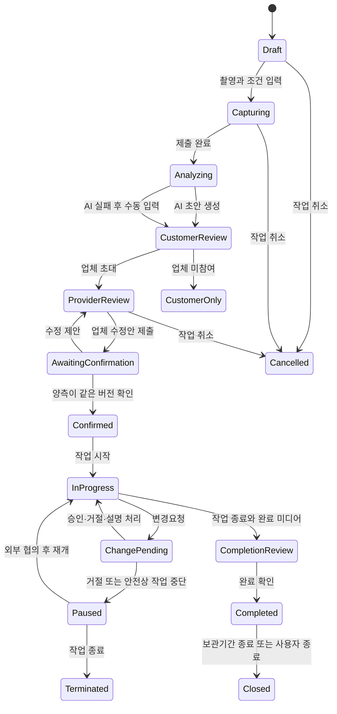

# 이사 작업범위 공동확인 서비스 — 기획 요약

> 버전: v0.1  
> 기준일: 2026-08-09  
> 제품 단계: 해커톤 MVP  
> 서비스 지역: 대한민국  
> 서비스 형태: 소비자 중심 무료 반응형 웹·PWA

---

## 1. 제품 정의

### 1.1 제품 목표

> **소비자가 선택한 이사업체와 계약을 확정하기 전에 방·구역별 짐과 작업조건, 포함범위, 총액을 하나의 버전 카드로 공동확인하고, 이사 당일 달라진 작업도 사유와 금액을 다시 승인하게 해 미합의 현장 추가금을 줄인다.**

### 1.2 한 줄 소개

> 영상으로 만든 이삿짐 초안을 소비자와 업체가 함께 고치고, 합의한 범위와 당일 변경을 한 카드에 남기는 무료 서비스

### 1.3 해결하려는 문제

이사 계약 전 전화·메신저·사진으로 흩어진 정보는 현장기사에게 동일하게 전달되지 않기 쉽다. 그 결과:

- 소비자는 계약금액에 어떤 짐과 작업이 포함됐는지 현장에서 즉시 확인하기 어렵다.
- 업체는 촬영되지 않았거나 상담 중 빠진 짐·접근조건 때문에 인력과 차량 계획이 달라질 수 있다.
- 현장기사는 고객·상담자가 합의한 최신 범위를 보지 못할 수 있다.
- 당일 추가 작업이 생겼을 때 사유, 증거, 금액, 승인 여부가 서로 다른 카카오톡과 구두 대화에 남는다.
- 사후에는 원래 합의와 당일 변경을 한 흐름으로 재구성하기 어렵다.

제품은 추가비용 자체를 금지하지 않는다. 정당한 추가 작업이라도 사전에 합의한 범위와 무엇이 다른지 보여주고, 금액을 다시 승인받게 만드는 것이 목적이다.

### 1.4 핵심 가치

1. 소비자는 계약 전에 자신이 **무엇에 얼마를 합의하는지** 확인한다.
2. 업체는 누락된 짐과 작업조건을 현장 전에 발견하고 수정한다.
3. 현장기사는 승인된 최신 작업범위를 작업 시작 전에 확인한다.
4. 당일 변경은 구두 요구가 아니라 기준 버전, 사유, 증거, 금액과 응답 상태로 남는다.
5. 완료 후에는 작업 전·완료 사진과 영상을 사람이 나란히 확인할 수 있다.

### 1.5 차별화 가설

- 업체 추천이나 견적 비교가 아닌 **특정 거래의 단일 작업범위 원장**
- 소비자·업체 담당자·현장기사가 같은 버전을 보는 **역할 기반 흐름**
- 국내 주거 이사에 맞춘 짐, 접근조건, 포장, 분해·조립, 포함·제외, 차량·인원 필드
- 현장 변경의 사유·증거·금액·승인 상태와 새 버전 기록
- 소비자가 먼저 생성해 이미 선택한 업체를 초대하는 **중립적 무료 서비스**

> 이는 검증 전 가설이며, 독립적으로 확인된 경쟁우위라고 표현하지 않는다.

---

## 2. 목표와 비목표

### 2.1 MVP 목표

- 방·구역별 영상에서 수정 가능한 이삿짐 초안을 생성한다.
- 출발지와 도착지의 작업조건을 구조화해 기록한다.
- 소비자와 업체가 같은 카드의 같은 버전을 각각 확인한다.
- 확인이 끝난 버전을 덮어쓰지 않고 이후 변경을 새 버전으로 남긴다.
- 현장 추가 작업에 사유, 증거, 증감액을 붙여 소비자의 응답을 받는다.
- 완료 사진·영상을 작업 전 자료와 나란히 열람할 수 있게 한다.
- 미합의 추가금 경험률을 측정할 최소 이벤트와 사후 질문을 남긴다.

### 2.2 MVP 비목표

- AR 공간 측정
- 자동 파손 탐지, 파손 전후 자동 비교, 책임 주체 판정
- OTP, 실명 인증, 사업자 인증, 법적 전자서명
- 자동 가격 계산, 적정가격 판정, 부피·차량·인원 자동 산정
- 업체 추천, 견적 비교, 예약 중개, 결제, 에스크로
- 보험 청구, 분쟁 조정, 법률 판단, 보상 지급
- 네이티브 앱, 오프라인 승인, 카카오톡·SMS 자동발송
- 사무실·기업·해외이사, 택배, 보관 전용, 셀프이사 관리

### 2.3 제품 약속의 표현

**허용:** "합의한 작업범위와 당일 변경을 한곳에 남겨 미합의 현장 추가금을 줄이기 위한 서비스"

**금지:**
- 추가금이 절대 발생하지 않는다.
- 모든 짐을 AI가 정확히 찾는다.
- 이 카드가 계약서와 같은 법적 효력을 가진다.
- 완료 영상으로 파손과 책임을 판정한다.
- 이 서비스를 쓰면 분쟁이 감소한다.

---

## 3. 대상 사용자

### 3.1 서비스 이용 대상

국내 주거 이사를 이사업체에 맡기고, 업체를 이미 선택했으나 작업범위와 최종 계약을 확정하기 전인 성인 소비자.

**지원 주거 형태:** 원룸·투룸, 오피스텔, 아파트, 연립·다세대·빌라, 단독·다가구·전원주택, 복층·다층 주거

### 3.2 현재 대상이 아닌 사용자

- 이사업체를 아직 선택하지 않아 추천이나 비교가 필요한 소비자
- 사업자 간 사무실·창고·공장 이전
- 해외이사, 택배, 보관 전용, 셀프이사만 필요한 사용자
- 법적 분쟁의 책임 판단이나 보상 결정을 서비스에 요구하는 사용자

### 3.3 참여 역할

| 역할 | 핵심 과업 | MVP 권한 |
| --- | --- | --- |
| **소비자** | 작업 생성, 촬영·조건 입력, AI 초안 검수, 카드 수정·확인, 변경 응답, 완료 기록 | 전체 작업 열람·수정 제안·확인·삭제 요청 |
| **업체 담당자** | 짐·조건 검토, 차량·인원·포장·총액 입력, 카드 수정·확인 | 초대된 작업 열람·수정 제안·확인 |
| **현장기사** | 작업 전 최신 승인본 확인, 당일 변경요청, 완료 기록 보조 | 승인본 열람·변경요청·완료 미디어 제출 |

> 업체 담당자와 현장기사는 MVP에서 사업자·실명 인증을 거치지 않는다. 화면에는 `소비자가 초대한 참여자`임을 명시한다.

---

## 4. 핵심 사용자 여정

### 4.1 정상 흐름

1. 소비자가 작업을 생성한다.
2. 이사일, 출발지·도착지 주거 형태와 기본 조건을 입력한다.
3. 출발지의 방·구역별 짧은 영상과 조건 사진을 제출한다.
4. 도착지는 영상 없이 층·엘리베이터·계단·주차·운반거리 답변만 필수로 받는다.
5. AI가 공간별 이삿짐 초안과 `확인 필요` 항목을 만든다.
6. 소비자가 AI 초안을 먼저 검수해 업체에 보낼 초안을 만든다.
7. 소비자가 선택한 업체 담당자에게 작업 링크를 공유한다.
8. 업체 담당자가 짐·조건·포장·분해조립·차량·인원·포함·제외·총액을 수정한다.
9. 소비자와 업체가 같은 버전을 각각 확인한다.
10. 현장기사가 작업 시작 전 최신 승인본을 연다.
11. 현장에서 범위 차이가 발견되면 기사가 사유·증거·추가 작업·금액을 등록한다.
12. 소비자가 승인, 거절 또는 설명 요청을 선택한다.
13. 승인된 변경은 새 작업범위 버전에 반영된다.
14. 작업 완료 후 소비자 또는 현장기사가 완료 사진·영상을 제출한다.
15. 소비자는 작업 전 자료와 완료 자료를 나란히 보고 완료 여부와 미합의 추가금 경험을 응답한다.

### 4.2 업체가 참여하지 않는 흐름

- 소비자 단독 카드를 만들 수 있으며 `업체 미참여`, `공동확인 전` 상태를 명확히 표시한다.
- 단독 카드를 출력하거나 링크로 전달할 수 있지만 `합의 완료`나 `승인본`이라고 표시하지 않는다.
- 업체가 나중에 참여하면 단독 초안을 기준으로 업체 검토 흐름을 시작한다.

### 4.3 AI 분석 실패 흐름

- 분석 실패는 작업 실패로 취급하지 않는다.
- 사진+체크리스트 또는 직접 입력으로 품목을 추가할 수 있다.
- 재시도 결과가 사용자의 수정을 자동으로 덮어쓰지 않는다.

---

## 5. 상태와 버전 모델

### 5.1 작업 상태 흐름

### 5.2 작업범위 버전 규칙

1. 모든 작업범위 카드는 정수 버전 번호를 가진다.
2. 한쪽의 수정 제안은 새 초안 버전을 만들고 기존 확인을 무효화한다.
3. 소비자와 업체가 같은 버전을 확인해야 `CONFIRMED`가 된다.
4. `CONFIRMED` 버전의 본문, 총액, 포함·제외 범위는 덮어쓰지 않는다.
5. 확인 이후 수정은 새 버전에서만 가능하다.
6. 승인된 당일 변경은 새 버전을 만들고 변경요청과 연결한다.
7. 동시에 같은 초안을 수정하면 충돌을 알리고 자동 덮어쓰지 않는다.
8. 확인 버튼 이름은 `서명`이나 `계약 확정`이 아니라 **`이 버전 내용 확인`**을 사용한다.

### 5.3 변경요청 상태

| 상태 | 의미 |
| --- | --- |
| `PENDING` | 소비자 응답 대기 |
| `EXPLANATION_REQUESTED` | 소비자가 추가 설명을 요청함 |
| `APPROVED` | 소비자가 증감액과 변경 작업을 승인함 |
| `REJECTED` | 소비자가 변경 작업과 금액을 거절함 |
| `CANCELLED` | 업체·기사가 요청을 철회함 |
| `EXPIRED` | 응답기한 경과로 더 이상 응답할 수 없음 |

> 변경요청을 거절해도 기존 승인 범위는 유지된다. 이후 협상이나 작업 중단 여부는 당사자가 서비스 밖에서 결정한다.

---

## 6. 작업범위 카드 정보 구조

### 6.1 거래 정보

- 이사 예정일시
- 출발지·도착지의 마스킹된 주소와 주거 형태
- 이사 유형: 일반·반포장·포장·기타
- 소비자 표시명 / 업체명·담당자 표시명 / 현장기사 표시명
- 작업 상태와 현재 버전

### 6.2 출발지·도착지 작업조건

각 위치별 필드:

- 주거 형태, 층수
- 엘리베이터 유무·크기·예약 필요 여부·모름
- 계단 작업 여부·모름
- 차량 진입·주차·상하차 위치·모름
- 차량에서 출입구까지 예상 운반거리·모름
- 사다리차 또는 별도 장비 필요 여부·업체 확인 필요
- 큰 가구 이동 동선의 제약
- 관리사무소 예약·작업 가능시간·소음 규정
- 기타 현장 조건, 조건 사진과 설명

> 계약 전 도착지 영상은 필수가 아니다. 알 수 없는 항목은 `모름·업체 확인 필요`로 저장한다.

### 6.3 공간별 물품

| 필드 | 설명 |
| --- | --- |
| 공간·구역 | 침실, 거실, 주방, 베란다, 창고, 복층 등 사용자 정의 가능 |
| 물품명 | 사람이 이해하는 일반 명칭 |
| 수량 | 확정 수량 또는 범위 |
| 분해·조립 | 불필요·분해만·조립만·분해와 조립·확인 필요 |
| 포장 주체 | 소비자·업체·협의 필요 |
| 주의사항 | 크기, 무게, 유리, 가전 분리 등 |
| 포함 여부 | 포함·제외·협의 필요 |
| 확인 상태 | AI 초안·소비자 확인·업체 확인·확인 필요 |

### 6.4 작업과 금액

- 차량 종류·대수 / 작업인원 (업체 수동 입력)
- 포장 유형과 포장재 제공 주체
- 분해·조립 작업 / 가전 탈부착·설치 포함 여부
- 폐기·정리·청소 등 부가 작업 포함 여부
- 명시적 포함·제외 서비스
- 추가요금이 가능하다고 사전에 합의한 사유
- **기준 총액**: 사람이 직접 입력한 원화 금액
- 가격 설명 또는 주의사항

> 제품은 가격을 산출하거나 적정성을 판정하지 않는다.

---

## 7. 주요 기능 영역

### 7.1 작업 생성과 참여

- 소비자는 회원가입 없이 새 작업을 만들 수 있다.
- 소비자는 업체 담당자 링크를 생성·복사·폐기·재발급할 수 있다.
- 업체 미참여 상태를 승인 완료와 구분해 표시한다.
- 업체는 현장기사용 링크를 발급할 수 있다.

### 7.2 촬영과 업로드

- 출발지는 방·구역별 15~30초 영상 촬영 흐름을 제공한다.
- 도착지는 계약 전 영상을 요구하지 않고 구조화 조건 답변만 필수로 받는다.
- 출·도착 조건 사진을 선택적으로 첨부할 수 있다.
- 업로드 실패 후 재시도와 수동 입력 대체경로를 제공한다.

### 7.3 AI 초안

- 출발지 영상을 비동기로 분석해 공간별 품목 초안을 만든다.
- 불확실하거나 중복 가능성이 있는 항목을 `확인 필요`로 표시한다.
- 사용자는 모든 AI 항목을 추가·수정·삭제할 수 있다.
- **가격·부피·차량·인원·접근조건·파손·책임을 자동 판단하지 않는다.**
- AI 실패 시 수동 카드 작성으로 진행할 수 있다.

### 7.4 공동 수정과 확인

- 소비자와 업체는 품목·조건·포함범위·총액의 수정안을 제출할 수 있다.
- 실시간 동시 편집 대신 버전 단위 수정 제안을 사용한다.
- 양측이 같은 버전에서 각각 `이 버전 내용 확인`을 눌러야 공동확인이 완료된다.
- 한쪽의 수정이 기존 확인을 무효화한다.
- 양측 확인이 끝난 버전은 덮어쓰지 않는다.

### 7.5 당일 변경

- 업체 담당자와 현장기사는 승인본을 기준으로 변경요청을 만들 수 있다.
- 변경 사유, 설명, 추가 작업, 증거, 증감액을 받는다.
- 소비자는 승인·거절·설명 요청 중 하나를 선택한다.
- 기존 총액, 증감액, 승인 후 총액을 함께 표시한다.
- 승인된 변경은 새 작업범위 버전을 만들고, 거절된 변경은 기존 승인본을 수정하지 않는다.

### 7.6 작업 완료와 전후 기록

- 작업 종료 후 완료 사진 또는 짧은 영상을 제출할 수 있다.
- 작업 전 자료와 완료 자료를 사람이 나란히 열람한다.
- 제품이 전후 기록으로 파손이나 책임을 판정하지 않음을 안내한다.
- 소비자에게 미합의 추가금 경험 여부를 질문한다.

---

## 8. AI 정책

### 허용 역할

- 영상에서 이동 대상으로 보이는 물품 후보 탐색
- 품목을 방·구역별로 묶기
- 수량을 확정값 또는 범위로 제안
- 분해·조립, 포장, 특수취급의 확인 질문 제안
- 중복·가림·낮은 확신 항목 표시
- 누락 의심 질문 생성

### 금지 역할

- 견적 또는 적정가격 산출
- 부피, 차량 대수, 인원 자동 확정
- 출·도착지 접근조건 자동 확정
- 파손 여부와 전후 차이 자동 판정
- 책임 주체 판단
- 작업의 합법성, 계약 효력, 분쟁 승패 판단

---

## 9. 완료 사진·영상 정책

- 완료 미디어는 작업 종료 시점의 상태를 함께 확인하고, 작업 전 촬영 자료와 사람이 비교할 수 있도록 남기는 기록이다.
- 화면은 작업 전 자료와 완료 자료를 동일 구역 기준으로 나란히 배치한다.
- AI 모델에 완료 미디어를 보내 파손이나 차이를 분석하지 않는다.
- 완료 미디어가 없어도 작업을 종료할 수 있지만 `완료 미디어 없음`을 표시한다.

### 필수 경계 문구

> 이 화면은 작업 전후 기록을 사람이 확인하기 위한 자료입니다. 서비스는 파손 여부, 원인 또는 책임 주체를 자동 판단하지 않습니다.

> 완료 확인은 작업 종료 사실을 기록하는 기능입니다. 서비스 만족, 파손 없음 또는 손해배상 청구권 포기를 의미하지 않습니다.

---

## 10. 개인정보와 접근권한 원칙

- 얼굴, 신분증, 문서, 가족사진, 귀중품은 촬영하지 않도록 안내한다.
- 정확한 주소는 필요한 참여자에게만 표시하고 다른 화면에서는 마스킹한다.
- AI 학습 목적의 2차 사용은 기본적으로 금지한다.
- 마케팅·광고·추천을 위해 집 내부 미디어를 사용하지 않는다.
- 작업마다 역할별 비밀 링크를 발급하고, 만료·폐기·재발급이 가능해야 한다.
- 제품은 미디어 다운로드 버튼을 제공하지 않는다.
- 링크 소유를 법적 본인 인증으로 표현하지 않는다.

---

## 11. UX 원칙

### 소비자 모바일 우선

- 첫 화면은 서비스 설명보다 `작업 만들기`와 개인정보 촬영 주의사항을 먼저 보여준다.
- 한 단계에는 한 가지 핵심 행동만 배치한다.
- 긴 작업범위 카드는 공간별로 접고 펼칠 수 있어야 한다.
- 상태는 색상만이 아니라 문장으로 표시한다 (예: `업체 검토 중`, `소비자 확인 필요`).

### 모든 주거 형태 대응

- 방 개수를 미리 고정하지 않고 사용자가 구역을 추가·이름 변경할 수 있게 한다.
- `방`이 없는 원룸과 창고·복층이 있는 주택을 같은 모델에서 표현한다.
- 주거 형태에 따라 조건 질문을 숨기지 않고 `해당 없음`, `모름`, `업체 확인 필요`를 제공한다.

### 쉬운 공동확인

- 수정된 필드만 모아보는 변경 요약을 제공한다.
- 확인 버튼 앞에서 버전, 총액, 포함·제외, 확인 필요 항목을 다시 보여준다.
- 변경요청 화면에서는 기존 총액과 새 총액을 가장 먼저 보여준다.

---

## 12. 성공 측정

### 핵심 결과지표

**미합의 추가금 경험률** = 소비자가 "승인된 변경기록 없이 추가금 요구를 경험했다"고 답한 완료 작업 비율

### 선행지표

| 지표 | 정의 |
| --- | --- |
| 업체 참여율 | 초대된 작업 중 업체가 검토를 시작한 비율 |
| 공동확인 완료율 | 업체가 참여한 작업 중 양측이 같은 버전을 확인한 비율 |
| 확인 소요시간 | 작업 생성부터 공동확인 완료까지 걸린 시간 |
| 기사 사전 열람률 | 작업 시작 전에 기사가 승인본을 연 비율 |
| 변경 기록률 | 현장 금액 변경 중 변경요청으로 기록된 비율 |
| 완료 미디어 제출률 | 완료 작업 중 완료 미디어를 제출한 비율 |
| AI 초안 수정률 | AI가 만든 품목 중 사람이 수정·삭제·추가한 비율 |

---

## 13. 초기 PoC와 통과 기준

### GO 기준

- 소비자 5명 중 4명 이상이 도움 없이 3분 안에 필수 입력·제출을 완료
- 업체 5곳 중 3곳 이상이 카드를 실제 다음 견적 흐름에서 검토
- 공동확인 완료율 80% 이상
- 현장기사가 작업 시작 전에 승인본을 모두 열람
- 수동 카드 작성 또는 AI 검수의 중앙값 10분 이하
- 치명적 누락이 작업당 1개 이하
- 시뮬레이션한 금액 변경이 모두 변경요청으로 기록
- 완료 작업 5건 중 4건 이상에 완료 미디어 제출
- 개인정보·무단접근·승인본 무결성 사고 0건

### NO-GO 신호

- 소비자와 업체가 같은 카드를 확인하지 않고 별도 메신저만 사용
- 업체가 공동기록 때문에 합법적 변경요청까지 할 수 없다고 인식
- 현장기사가 작업 전에 승인본을 열지 않음
- 승인·거절 없이 현장 변경이 계속 진행
- 완료 미디어가 자동 파손 판정으로 오인됨

---

## 14. 확정 결정 로그

| ID | 결정 | 상태 |
| --- | --- | --- |
| D-001 | 서비스 이용 대상을 국내 주거 이사 소비자 전체로 둔다. | 확정 |
| D-002 | 원룸·오피스텔·아파트·빌라·단독·복층 등 주거 형태를 데이터와 검증 표본에 반영한다. | 확정 |
| D-003 | 계약 전 도착지 영상은 필수가 아니며 접근조건 구조화 답변은 필수, 사진은 선택이다. | 확정 |
| D-004 | 작업 완료 후 사진·영상을 제출하고 작업 전 자료와 사람이 나란히 확인한다. | 확정 |
| D-005 | 완료 미디어에 AI 파손 탐지·자동 차이 분석·책임 판정을 적용하지 않는다. | 확정 |
| D-006 | 소비자는 계속 무료이며 업체와 현장기사도 MVP에서 무료다. | 확정 |
| D-007 | 소비자가 작업을 만들고 이미 선택한 업체를 초대한다. | 확정 |
| D-008 | AI는 이삿짐 초안과 확인 필요 항목만 만들며 가격을 계산하지 않는다. | 확정 |
| D-009 | 양측이 같은 버전을 확인하고 승인본을 덮어쓰지 않는다. | 확정 |
| D-010 | 당일 변경은 기준 버전·사유·증거·금액·응답 상태와 새 버전을 남긴다. | 확정 |
| D-011 | AR·OTP·자동가격·견적비교·파손탐지는 MVP에서 제외한다. | 확정 |

---

## 15. 남은 검증 항목

- 공동 카드와 재승인이 실제 미합의 추가금을 얼마나 줄이는지
- 모든 주거 형태에서 공통 촬영 흐름과 카드가 충분한지
- 선택한 업체가 소비자 초대 링크에 실제로 참여하는지
- 링크 소유 기반 확인이 사용자에게 충분히 신뢰되는지
- 완료 사진·영상이 가치 있는 기록인지, 파손 판정으로 오인되는지
- 대형 주거 형태에서도 구역별 촬영을 부담 없이 완료할 수 있는지

> 이 항목은 인터뷰 응답이 아니라 실제 사용행동, 오류, 시간, 누락과 완료율로 검증한다.
