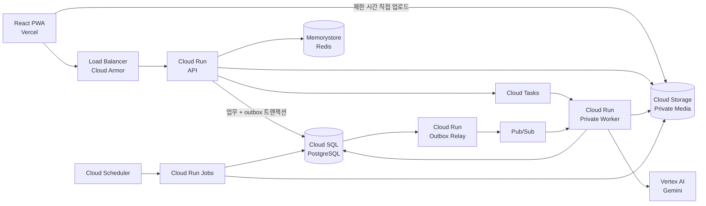

# 기술 스택 및 아키텍처 결정

> 상태: 확정  
> 기준일: 2026-08-12  
> 적용 범위: SEQRET Frontend, Backend, GCP 운영 환경

## 1. 목표

SEQRET은 소비자, 이사업체 담당자, 현장기사가 같은 작업범위 버전과 변경 이력을 공동으로 확인하는 서비스다. 기술 구성은 시제품이 아닌 실제 서비스 운영을 기준으로 하며 다음 조건을 우선한다.

- 모바일 PWA에서 사진·짧은 영상을 안정적으로 업로드한다.
- AI 분석, 미디어 후처리, 알림과 삭제 작업을 비동기로 처리한다.
- 확인된 작업범위 버전과 감사 이력은 변경 불가능한 기록으로 보존한다.
- 개인정보와 비공개 미디어에 최소 권한과 제한 시간 접근을 적용한다.
- GCP 관리형 서비스의 운영 편의는 사용하되, 핵심 비즈니스 코드는 특정 클라우드 SDK에 종속시키지 않는다.

## 2. 확정 기술 스택

| 구분 | 기술 | 선정 이유 |
| --- | --- | --- |
| Frontend | React, TypeScript | 컴포넌트 기반 UI와 정적 타입으로 복잡한 역할별 화면과 상태를 안전하게 관리한다. |
| Build | Vite | 빠른 개발 서버와 단순한 정적 빌드 구성을 제공한다. |
| Server State | TanStack Query | API 캐시, 재시도, 무효화와 비동기 서버 상태를 일관되게 관리한다. |
| Application | PWA | 별도 앱 설치 장벽을 낮추면서 모바일 촬영·현장 확인 경험을 제공한다. |
| Frontend Hosting | Vercel | 정적 프론트 배포, Preview 환경과 롤백을 단순화한다. |
| Language | Python 3.13 | AI 생태계와 백엔드 생산성을 확보하고 장기 보안 지원 범위를 사용한다. |
| API | FastAPI, Pydantic | 비동기 HTTP API, 요청·응답 검증과 OpenAPI 문서화를 일관되게 제공한다. |
| ORM / Migration | SQLAlchemy, Alembic | PostgreSQL 데이터 접근과 스키마 변경 이력을 명시적으로 관리한다. |
| Database | PostgreSQL on Cloud SQL | 트랜잭션, 관계, 잠금과 감사 데이터에 적합하며 관리형 HA·백업을 활용할 수 있다. |
| Cache | Redis on Memorystore | 짧은 수명의 캐시, rate limit 보조 데이터와 분산 동시성 제어에 사용한다. 원본 데이터는 저장하지 않는다. |
| Object Storage | Google Cloud Storage | 대용량 비공개 미디어, 직접 업로드, 수명주기와 제한 시간 접근 URL을 제공한다. |
| Compute | Docker on Cloud Run | 컨테이너 이식성을 유지하면서 서버 관리, 자동 확장과 revision 롤백 부담을 줄인다. |
| Task Queue | Cloud Tasks | 재시도, 지연 실행, 처리율 제한이 필요한 일대일 비동기 명령을 관리형으로 처리한다. |
| Long-running Work | Cloud Run Jobs | 장시간 분석, 대량 삭제, 정합성 점검과 복구 작업을 완료형 컨테이너 작업으로 실행한다. |
| Event | Pub/Sub | 하나의 도메인 사건을 알림, 감사, 분석 등 여러 소비자가 받아야 할 때만 사용한다. |
| Schedule | Cloud Scheduler | 보존기간 삭제, 정합성 점검과 정기 job 실행을 관리한다. |
| AI | Vertex AI, Gemini | 영상·이미지 이해를 사용해 사람이 수정할 수 있는 작업범위 초안을 생성한다. |
| Security | Cloud Armor, Secret Manager, Cloud IAM | 외부 공격 방어, 비밀정보 관리와 서비스별 최소 권한을 적용한다. |
| Infrastructure | Terraform, Cloud Load Balancing | 재현 가능한 환경 구성과 Cloud Run 앞단의 단일 보안 진입점을 제공한다. |
| CI/CD | GitHub Actions, Artifact Registry | 테스트부터 digest 기반 컨테이너 배포까지 자동화하고 배포 산출물을 추적한다. |
| Observability | OpenTelemetry, Cloud Logging, Cloud Monitoring | 애플리케이션 계측을 벤더 중립적으로 유지하면서 GCP 운영 도구를 활용한다. |

## 3. 배포 구조



단일 백엔드 코드베이스를 다음 실행 단위로 배포한다.

- `api`: 사용자 요청, 권한 검사, 트랜잭션과 작업 접수
- `worker`: Cloud Tasks와 Pub/Sub에서 전달된 짧은 비동기 작업 처리
- `job`: 마이그레이션, 장시간 처리, 보존기간 삭제, 정합성 검사와 복구

## 4. 비동기 처리 기준

| 작업 성격 | 실행 수단 | 예시 |
| --- | --- | --- |
| 30분 이내, 단일 소비자, 재시도 필요 | Cloud Tasks → private Cloud Run worker | AI 분석 요청, 썸네일 생성, 알림 발송 |
| 장시간 또는 완료형 배치 | Cloud Run Jobs | 대량 삭제, 재처리, 복구, 장시간 미디어 처리 |
| 하나의 사건을 여러 소비자가 구독 | Pub/Sub | 범위 확정 이후 감사·알림·분석 이벤트 |
| 정기 실행 | Cloud Scheduler → Cloud Run Job | 보존기간 삭제, 고아 미디어 및 outbox 정합성 점검 |

다음 규칙은 모든 비동기 작업에 적용한다.

- 전달 방식은 최소 한 번 실행될 수 있다고 가정하고 모든 handler를 멱등하게 구현한다.
- 작업 상태, 시도 횟수, 마지막 오류와 결과는 PostgreSQL의 job 레코드에 저장한다.
- 메시지에는 원본 미디어나 전체 업무 데이터를 넣지 않고 `job_id`, `event_type`, `schema_version`과 추적 ID만 전달한다.
- 재시도 불가능한 오류와 재시도 소진 작업은 운영자가 조회하고 재실행할 수 있어야 한다.
- 도메인 이벤트 발행은 PostgreSQL Transactional Outbox를 사용해 업무 트랜잭션과 유실 없이 연결한다.

## 5. 데이터 원본과 저장 원칙

| 데이터 | 원본 저장소 | 원칙 |
| --- | --- | --- |
| 작업, 참여자, 범위 버전, 확인, 변경요청 | PostgreSQL | 업무의 유일한 원본이다. |
| 감사 이력 | PostgreSQL | append-only로 기록하며 일반 수정·삭제 경로를 제공하지 않는다. |
| 비동기 작업 상태 | PostgreSQL | Cloud Tasks 또는 Pub/Sub 상태를 업무 상태로 사용하지 않는다. |
| 사진·영상·파생 미디어 | Cloud Storage | 비공개 bucket에 저장하고 DB에는 object key와 메타데이터만 둔다. |
| 캐시·rate limit 보조 데이터 | Redis | 유실돼도 PostgreSQL로부터 복구 가능해야 한다. |
| AI 결과 | PostgreSQL + Cloud Storage | 모델·프롬프트·결과 스키마 버전을 기록하며 사람이 확정하기 전에는 초안이다. |

확정된 `scope_version`은 수정하지 않는다. 변경은 항상 부모 버전을 참조하는 새 버전으로 만들고, 양측 확인은 동일한 버전과 `content_hash`를 대상으로 기록한다.

## 6. 클라우드 종속성 경계

GCP 사용 자체를 피하지 않는다. 대신 교체 비용이 핵심 비즈니스 코드로 전파되지 않도록 다음 포트를 둔다.

```text
TaskQueuePort       -> Cloud Tasks adapter
EventBusPort        -> Pub/Sub adapter
ObjectStoragePort   -> Cloud Storage adapter
CachePort           -> Redis adapter
AIProviderPort      -> Vertex AI adapter
```

- 도메인 계층과 애플리케이션 계층에서 `google.cloud.*`를 import하지 않는다.
- GCP 요청·응답 타입을 서비스 메서드와 도메인 모델에 노출하지 않는다.
- 서명된 URL은 저장하지 않고 요청 시 생성한다.
- 이벤트 envelope와 AI 출력은 버전이 있는 Pydantic 모델로 정의한다.
- 각 포트는 로컬 fake와 실제 provider contract test를 갖는다.
- Terraform의 provider별 코드는 애플리케이션 저장소 구조와 분리한다.

향후 이전이 필요하면 다음 대응 관계를 기준으로 인프라와 adapter를 교체한다.

| 현재 | 이전 후보 |
| --- | --- |
| Cloud Run | AWS ECS/Fargate, Azure Container Apps 또는 다른 컨테이너 런타임 |
| Cloud Tasks | Celery/RabbitMQ, Amazon SQS 또는 다른 task queue |
| Pub/Sub | RabbitMQ, Kafka 또는 다른 event bus |
| Cloud SQL PostgreSQL | Amazon RDS PostgreSQL 또는 일반 PostgreSQL |
| Memorystore | ElastiCache 또는 일반 Redis |
| Cloud Storage | Amazon S3 또는 S3 adapter |
| Vertex AI | 다른 AI provider adapter |

## 7. 운영·보안 기준

- 개발, staging, production은 별도 GCP project와 별도 데이터 저장소로 분리한다.
- production Cloud SQL은 Regional HA, PITR, 자동 백업과 삭제 방지를 적용하고 정기 복구 훈련을 수행한다.
- production Redis는 고가용 구성으로 운영하되 서비스가 Redis 장애 시 원본 DB로 제한적 동작할 수 있어야 한다.
- Cloud Run API만 외부 진입점으로 공개하고 worker와 job은 전용 service account 인증을 요구한다.
- 각 실행 단위는 별도 service account와 최소 IAM 권한을 사용한다.
- 객체 스토리지의 public access를 차단하고 업로드·열람 URL에는 짧은 만료시간, 객체 범위와 콘텐츠 제약을 적용한다.
- 비밀 역할 링크의 원문 토큰은 저장하지 않고 hash, 역할, 만료, 철회 시각과 사용 이력을 저장한다.
- 미디어의 보존기간 삭제는 lifecycle 설정만 믿지 않고 DB 삭제 상태와 정기 reconciliation job으로 검증한다.
- GitHub Actions는 장기 GCP 키 대신 OIDC 기반 단기 자격증명을 사용한다.
- 컨테이너는 변경 불가능한 image digest로 배포하고 DB migration 성공 이후에만 production 트래픽을 전환한다.
- 구조화 로그에 `request_id`, `trace_id`, `job_id`를 포함하되 토큰, 주소 원문과 signed URL은 기록하지 않는다.
- SLO, 오류율, 지연시간, queue 적체, AI 실패율, DB 연결 수와 미디어 삭제 실패에 경보를 둔다.

## 8. 명시적으로 사용하지 않는 기술

| 기술 | 결정 이유 |
| --- | --- |
| Kubernetes / GKE | 현재 서비스에 필요한 운영 편의보다 클러스터 운영 복잡도와 비용이 크다. 컨테이너 이식성은 Docker와 애플리케이션 경계로 확보한다. |
| Celery / RabbitMQ | Cloud Run 환경에서 worker·broker HA·autoscaling 운영 부담이 Cloud Tasks의 종속성 비용보다 크다. task queue port를 통해 향후 교체 가능성을 유지한다. |
| Supabase | 데이터, 인증과 스토리지를 별도 GCP 운영 기준으로 통제하기 위해 사용하지 않는다. |
| Amazon S3 | GCP 운영 환경에서는 Cloud Storage를 사용한다. 코드에서는 object storage port로 분리한다. |
| Kafka | 현재 이벤트 처리량과 replay 요구에 비해 운영 복잡도가 크다. 장기 event stream 요구가 검증될 때 별도로 결정한다. |
| Vercel Functions | 프론트 호스팅과 핵심 백엔드의 책임을 분리하고 서버 로직의 Vercel 종속을 피한다. |

## 9. 변경 관리

이 문서는 전체 시스템 기술 결정의 단일 기준이다. 기술을 추가하거나 교체할 때는 다음 내용을 포함한 ADR을 `docs/adr/`에 작성한다.

1. 해결할 문제와 실제 요구사항
2. 검토한 대안
3. 선택 이유와 운영 비용
4. 데이터·보안·가용성 영향
5. 철회 조건과 이전 방법

편의상 도입한 provider 기능이 도메인 규칙이나 원본 데이터 모델을 결정하지 않도록 코드 리뷰에서 확인한다.

## 10. 공식 참고자료

- [Cloud Run 개요](https://cloud.google.com/run/docs/overview/what-is-cloud-run)
- [Cloud Tasks 개요](https://cloud.google.com/tasks/docs/dual-overview)
- [Cloud Run Jobs](https://cloud.google.com/run/docs/create-jobs)
- [Cloud SQL for PostgreSQL](https://cloud.google.com/sql/docs/postgres/introduction)
- [Cloud Storage](https://cloud.google.com/storage/docs/introduction)
- [OpenTelemetry](https://opentelemetry.io/docs/)
